# Proxilion SDK -- Refinement Spec v2

**Version:** 0.0.7 -> 0.0.8
**Date:** 2026-03-15
**Status:** READY FOR IMPLEMENTATION
**Previous spec:** docs/specs/spec-v1.md (0.0.6 -> 0.0.7, all 15 steps complete)

---

## Executive Summary

This spec covers the third improvement cycle for the Proxilion SDK. The previous two specs addressed critical bugs, memory leaks, streaming robustness, version drift, CI hardening, secret key validation, documentation, thread safety, and security regression tests. All prior work is complete and verified: 2,489 tests pass, 5 skip (OPA optional dependency), ruff clean, format clean, version synchronized at 0.0.7.

This cycle focuses on refinements that improve reliability, security posture, maintainability, and developer experience without introducing net-new features. Every item targets code that already exists. The goal is to bring the SDK from a strong alpha to a bulletproof MVP that inspires confidence in security auditors, contributors, and production operators.

---

## Codebase Snapshot (2026-03-15)

| Metric | Value |
|--------|-------|
| Python source files | 89 |
| Source lines (proxilion/) | 53,866 |
| Test files | 62 |
| Test count | 2,494 collected, 2,489 passed, 5 skipped |
| Python versions tested | 3.10, 3.11, 3.12, 3.13 |
| Ruff lint violations | 0 |
| Ruff format violations | 0 |
| Mypy errors | 5 (all in pydantic_schema.py, optional dep handling) |
| Version (pyproject.toml) | 0.0.7 |
| Version (__init__.py) | 0.0.7 |
| CI/CD | GitHub Actions (test, lint, typecheck, pip-audit) |
| Coverage threshold | 85% (enforced in CI) |
| Broad except Exception catches | 70 across 25 files |
| Documentation pages | 10 feature docs, README, quickstart, CLAUDE.md |

---

## Logic Breakdown: Deterministic vs Probabilistic

All security decisions in Proxilion are deterministic. This table quantifies the breakdown across all 89 source modules.

| Logic Type | Percentage | Module Count | Description |
|------------|-----------|--------------|-------------|
| Deterministic | 97% | 86 of 89 | Regex pattern matching, HMAC-SHA256 verification, SHA-256 hash chains, set membership checks, token bucket counters, state machine transitions, boolean policy evaluation, frozen dataclass construction, JSON serialization, file I/O with locking |
| Bounded Statistical | 3% | 3 of 89 | Token estimation heuristic in context/message_history.py (1.3 words-per-token ratio), risk score aggregation in guards (weighted sum of deterministic pattern matches), behavioral drift z-score thresholds (statistical analysis on recorded metrics, not ML inference) |

Zero LLM inference calls, zero ML model evaluations, zero neural network weights, and zero non-deterministic random decisions exist in the security path. The three "statistical" modules use bounded arithmetic on locally recorded counters. Their outputs are reproducible given identical input sequences.

---

## Step 1 -- Fix Mypy Errors in Pydantic Optional Import Handling

> **Priority:** HIGH
> **Estimated complexity:** Low
> **Files:** proxilion/validation/pydantic_schema.py

### Problem

There are 5 mypy errors in `pydantic_schema.py`, all caused by assigning `None` to `BaseModel` and `ValidationError` in the `except ImportError` branch of the conditional pydantic import. Mypy strict mode flags these as type-incompatible assignments. There is also one stale `type: ignore[no-any-return]` comment on line 286.

Current code (lines 27-36):

```
try:
    from pydantic import BaseModel, ValidationError, create_model
    from pydantic.fields import FieldInfo
    from pydantic_core import PydanticUndefined
    HAS_PYDANTIC = True
except ImportError:
    HAS_PYDANTIC = False
    BaseModel = None
    ValidationError = None
```

### Intent

As a developer running `mypy proxilion` in strict mode, I expect zero errors. Currently there are 5, all in one file. Fixing these means CI typecheck passes cleanly and future real type errors are not lost in noise.

### Fix

Replace the conditional import with a pattern that mypy understands. Use `Optional[type[...]]` annotations for the fallback assignments so mypy can track both branches. Remove the stale type-ignore comment on line 286.

### Claude Code Prompt

```
Read proxilion/validation/pydantic_schema.py. The conditional import block at lines 27-36 causes 5 mypy errors because `BaseModel = None` and `ValidationError = None` are type-incompatible with the imported classes.

Fix approach: Change the except ImportError block to use explicit type annotations that mypy accepts. The standard pattern for optional dependency fallbacks that satisfies mypy strict mode is:

1. Add `from typing import Any` if not already imported.
2. In the except block, annotate: `BaseModel: Any = None` and `ValidationError: Any = None`.
3. Also set `create_model: Any = None`, `FieldInfo: Any = None`, `PydanticUndefined: Any = None` in the except block to cover all pydantic imports.
4. Remove the stale `# type: ignore[no-any-return]` comment on line 286.

After changes, run:
- `python3 -m mypy proxilion/ --ignore-missing-imports` -- expect 0 errors
- `python3 -m pytest tests/test_validation_pydantic.py -v` -- expect all pass
- `python3 -m pytest -x -q` -- expect 2489 passed, 5 skipped
```

---

## Step 2 -- Narrow Broad Exception Catches in Security Modules

> **Priority:** HIGH
> **Estimated complexity:** Medium
> **Files:** proxilion/security/idor_protection.py, proxilion/security/cascade_protection.py, proxilion/security/behavioral_drift.py, proxilion/security/circuit_breaker.py, proxilion/security/intent_validator.py

### Problem

There are 70 `except Exception` catches across 25 files. While many are intentional in integration boundary code (cloud exporters, contrib handlers, resilience modules), the security modules should use narrower exception types. Broad catches in security code risk silently swallowing unexpected errors that could mask security bypasses.

Security module broad catches identified (12 instances across 5 files):

1. `idor_protection.py:235,262,340` -- Custom scope extractor callbacks. Currently catches all exceptions when calling user-provided extractors.
2. `cascade_protection.py:760` -- Health check callback execution. Catches all exceptions from user-provided health check functions.
3. `behavioral_drift.py:470,601,625` -- Metric recording and analysis callbacks. Catches all exceptions during statistical computation.
4. `circuit_breaker.py:270,334` -- Wrapped function execution. Intentionally catches all exceptions to track failure counts, but the re-raise logic should be explicit.
5. `intent_validator.py:212` -- Pattern matching on tool usage history.

### Intent

As a security auditor reviewing the SDK, when I see `except Exception` in a security module, I cannot distinguish between "this is an intentional catch-all for user-provided callbacks" and "this is a bug that swallows real errors." Narrowing these catches or adding explicit documentation makes the security intent auditable.

### Fix

For each broad catch in the 5 security modules:

1. Where the catch wraps a user-provided callback (extractor, health check), keep `except Exception` but add a comment: `# Catch-all: user-provided callback may raise any exception`. Log the exception at WARNING level with the callback name.
2. Where the catch wraps internal logic (statistical computation, pattern matching), narrow to the specific expected exceptions: `ValueError`, `TypeError`, `KeyError`, `ZeroDivisionError`.
3. In circuit_breaker.py, the catch-all is correct (it must count any failure), but verify that the original exception is always re-raised after incrementing the failure counter.

Do not touch the broad catches in: contrib/ (external SDK boundaries), resilience/ (intentional catch-for-retry), audit/exporters/ (cloud API boundaries), or core.py (authorization pipeline catch-and-audit).

### Claude Code Prompt

```
Read the following files and narrow the broad exception catches in security modules only:

1. Read proxilion/security/idor_protection.py. Find the `except Exception` blocks at lines 235, 262, 340. These wrap user-provided scope extractor callbacks. Keep `except Exception` but add a comment `# Catch-all: user-provided extractor may raise any exception` and ensure the exception is logged at WARNING level with `logger.warning("Scope extractor %s raised: %s", extractor_name, e)`. If the exception is not currently logged, add the log line.

2. Read proxilion/security/cascade_protection.py. Find the `except Exception` at line 760. This wraps a user-provided health check function. Same treatment: keep the catch-all, add the documenting comment, ensure WARNING-level logging.

3. Read proxilion/security/behavioral_drift.py. Find the `except Exception` blocks at lines 470, 601, 625. These wrap internal statistical computations. Narrow to `except (ValueError, TypeError, ZeroDivisionError, KeyError) as e:`. If any of these catches are wrapping user-provided callbacks, keep as `except Exception` with the documenting comment instead.

4. Read proxilion/security/circuit_breaker.py. Find the `except Exception` blocks at lines 270, 334. These wrap the user-provided function being protected by the circuit breaker. The catch-all is correct here (any exception counts as a failure). Verify the exception is re-raised after incrementing the failure counter. Add comment: `# Catch-all: any exception from protected function counts as failure`.

5. Read proxilion/security/intent_validator.py. Find the `except Exception` at line 212. Determine if it wraps internal logic or user-provided code. If internal, narrow to specific exceptions. If user-provided, document with comment.

After all changes, run:
- `python3 -m ruff check proxilion/security/` -- expect 0 violations
- `python3 -m pytest tests/test_security/ -v` -- expect all pass
- `python3 -m pytest -x -q` -- expect 2489 passed, 5 skipped
```

---

## Step 3 -- Fix Documentation Reference Error in Features Guide

> **Priority:** HIGH
> **Estimated complexity:** Trivial
> **Files:** docs/features/README.md

### Problem

The features README at `docs/features/README.md` uses the class name `MemoryIntegrityChecker` in at least one location. The actual class in the codebase is `MemoryIntegrityGuard` (in `proxilion/security/memory_integrity.py`). Any developer copying the example code will get an `ImportError`.

### Intent

As a developer reading the features guide and copying example code, when I use the class name shown in the documentation, I expect it to match the actual class exported by the SDK. Currently it does not.

### Fix

Search `docs/features/README.md` for all occurrences of `MemoryIntegrityChecker` and replace with `MemoryIntegrityGuard`. Also search all other docs files for the same error.

### Claude Code Prompt

```
Search all files in docs/ for "MemoryIntegrityChecker" (case-sensitive). Replace every occurrence with "MemoryIntegrityGuard". Then verify the fix by running:
- `grep -r "MemoryIntegrityChecker" docs/` -- expect no results
- `grep -r "MemoryIntegrityGuard" docs/` -- expect at least one result
```

---

## Step 4 -- Add Python 3.13 Classifier and Validate pyproject.toml

> **Priority:** MEDIUM
> **Estimated complexity:** Trivial
> **Files:** pyproject.toml

### Problem

The CI pipeline tests Python 3.13 (added in spec-v1 step 4), but `pyproject.toml` classifiers only list 3.10, 3.11, and 3.12. This means PyPI consumers cannot filter by Python 3.13 support, and the metadata is inconsistent with tested capabilities.

### Intent

As a developer searching PyPI for packages that support Python 3.13, when I look at Proxilion's metadata, I expect to see 3.13 listed as a supported version since it is tested in CI.

### Fix

Add `"Programming Language :: Python :: 3.13"` to the classifiers list in pyproject.toml.

### Claude Code Prompt

```
Read pyproject.toml. In the classifiers list, add "Programming Language :: Python :: 3.13" after the line for 3.12. Run `python3 -c "import tomllib; tomllib.load(open('pyproject.toml','rb'))"` to verify the TOML is valid.
```

---

## Step 5 -- Add Structured Error Context to Security Exceptions

> **Priority:** MEDIUM
> **Estimated complexity:** Medium
> **Files:** proxilion/exceptions.py

### Problem

The 22 exception types in `exceptions.py` raise with string messages only. When an operator catches a `RateLimitExceeded` in production, they get a message like `"Rate limit exceeded for user_123"` but no structured fields for: which user, which limit, what the current count was, or when the limit resets. This forces operators to parse string messages for monitoring and alerting.

### Intent

As an operator running Proxilion in production, when I catch a `RateLimitExceeded` exception, I expect to access structured fields like `exception.user_id`, `exception.limit`, `exception.current_count`, and `exception.reset_at` without parsing the message string. This enables programmatic alerting and dashboarding.

As an operator catching `CircuitOpenError`, I expect `exception.circuit_name`, `exception.failure_count`, `exception.reset_timeout`.

As a developer catching `IDORViolationError`, I expect `exception.user_id`, `exception.resource_type`, `exception.resource_id`.

### Fix

Add optional keyword arguments to the security exception constructors. Each exception class gets relevant structured context fields stored as instance attributes. The string message remains the primary representation. The structured fields are optional to preserve backward compatibility -- existing code that raises these exceptions with just a string message continues to work.

Exceptions to enhance (7 of 22):
1. `RateLimitExceeded` -- add `user_id`, `limit`, `current_count`, `window_seconds`, `reset_at`
2. `CircuitOpenError` -- add `circuit_name`, `failure_count`, `reset_timeout`
3. `IDORViolationError` -- add `user_id`, `resource_type`, `resource_id`
4. `GuardViolation` (and subclasses) -- add `guard_type`, `matched_patterns`, `risk_score`, `input_text_preview`
5. `SequenceViolationError` -- add `rule_name`, `tool_name`, `user_id`
6. `BudgetExceededError` -- add `user_id`, `budget_limit`, `current_spend`
7. `IntentHijackError` -- add `tool_name`, `allowed_tools`, `user_id`

Do not change: `ProxilionError`, `AuthorizationError`, `PolicyViolation`, `PolicyNotFoundError`, `ConfigurationError`, `ApprovalRequiredError`, `FallbackExhaustedError`, `ScopeLoaderError`, `SchemaValidationError`, `ScopeViolationError`, `ContextIntegrityError`, `AgentTrustError`, `BehavioralDriftError`, `EmergencyHaltError`.

### Claude Code Prompt

```
Read proxilion/exceptions.py. For each of the 7 exception classes listed below, add optional keyword-only arguments to __init__ that store structured context. Keep backward compatibility: the first positional argument remains the string message, and all new fields default to None.

Pattern for each exception:

class RateLimitExceeded(ProxilionError):
    def __init__(
        self,
        message: str = "Rate limit exceeded",
        *,
        user_id: str | None = None,
        limit: int | None = None,
        current_count: int | None = None,
        window_seconds: float | None = None,
        reset_at: float | None = None,
    ) -> None:
        super().__init__(message)
        self.user_id = user_id
        self.limit = limit
        self.current_count = current_count
        self.window_seconds = window_seconds
        self.reset_at = reset_at

Apply this pattern to:
1. RateLimitExceeded -- user_id, limit, current_count, window_seconds, reset_at
2. CircuitOpenError -- circuit_name, failure_count, reset_timeout
3. IDORViolationError -- user_id, resource_type, resource_id
4. GuardViolation -- guard_type, matched_patterns (list[str] | None), risk_score (float | None), input_preview (str | None)
5. SequenceViolationError -- rule_name, tool_name, user_id
6. BudgetExceededError -- user_id, budget_limit (float | None), current_spend (float | None)
7. IntentHijackError -- tool_name, allowed_tools (list[str] | None), user_id

After adding the structured fields, update the raise sites in the corresponding modules to pass the structured context where available. For example, in proxilion/security/rate_limiter.py, when raising RateLimitExceeded, pass user_id=key, limit=self._capacity, etc.

Run:
- `python3 -m ruff check proxilion/exceptions.py` -- expect 0 violations
- `python3 -m mypy proxilion/exceptions.py --ignore-missing-imports` -- expect 0 errors
- `python3 -m pytest -x -q` -- expect 2489 passed, 5 skipped
```

---

## Step 6 -- Add Tests for Structured Exception Context

> **Priority:** MEDIUM
> **Estimated complexity:** Low
> **Files:** tests/test_exceptions.py (new)

### Problem

After Step 5 adds structured fields to exceptions, there are no tests verifying that: (a) the structured fields are set correctly when exceptions are raised, (b) backward compatibility is maintained when raising with just a string message, and (c) the fields are accessible on caught exceptions.

### Intent

As a developer catching `RateLimitExceeded`, when I access `exception.user_id`, I expect the value that was passed at the raise site. As a developer raising `RateLimitExceeded("custom message")` without keyword arguments, I expect all structured fields to be None (backward compatibility).

### Fix

Create `tests/test_exceptions.py` with tests for all 7 enhanced exceptions covering: default construction, message-only construction, fully-specified construction, field access, and inheritance chain verification.

### Claude Code Prompt

```
Create tests/test_exceptions.py. For each of the 7 enhanced exceptions (RateLimitExceeded, CircuitOpenError, IDORViolationError, GuardViolation, SequenceViolationError, BudgetExceededError, IntentHijackError), write:

1. test_default_message -- Construct with no args, verify default message and all fields are None.
2. test_custom_message -- Construct with just a string, verify message is set and all fields are None.
3. test_structured_fields -- Construct with message and all keyword args, verify each field is accessible.
4. test_inheritance -- Verify exception inherits from ProxilionError and can be caught as such.
5. test_str_representation -- Verify str(exception) returns the message.

Also test:
- InputGuardViolation and OutputGuardViolation inherit from GuardViolation and gain its structured fields.
- All 7 exceptions are importable from proxilion (top-level __init__.py).

Run `python3 -m pytest tests/test_exceptions.py -v` to verify all pass.
Run `python3 -m pytest -x -q` to verify no regressions.
```

---

## Step 7 -- Wire Structured Exception Context to Raise Sites

> **Priority:** MEDIUM
> **Estimated complexity:** Medium
> **Files:** proxilion/security/rate_limiter.py, proxilion/security/circuit_breaker.py, proxilion/security/idor_protection.py, proxilion/guards/input_guard.py, proxilion/guards/output_guard.py, proxilion/security/sequence_validator.py, proxilion/security/cost_limiter.py, proxilion/security/intent_capsule.py

### Problem

After Step 5 adds structured fields to exceptions and Step 6 tests them, the actual raise sites in the security modules still raise with string messages only. The structured context fields are available at the raise site but are not passed to the exception constructors.

### Intent

As an operator, when `RateLimitExceeded` is raised by the token bucket rate limiter, I expect `exception.user_id` to contain the actual user ID, `exception.limit` to contain the bucket capacity, and `exception.current_count` to contain the number of requests made. This data is available at the raise site but is not currently forwarded.

### Fix

For each security module that raises one of the 7 enhanced exceptions, update the `raise` statement to include the structured keyword arguments. The data is already computed at each raise site; it just needs to be passed through.

### Claude Code Prompt

```
For each of the following files, read the file, find every `raise` statement that raises one of the 7 enhanced exceptions, and add the structured keyword arguments using data available at the raise site:

1. proxilion/security/rate_limiter.py -- Find all `raise RateLimitExceeded(...)`. Add user_id, limit, current_count, window_seconds where available from the method's local variables.

2. proxilion/security/circuit_breaker.py -- Find all `raise CircuitOpenError(...)`. Add circuit_name (use self._name or resource name), failure_count, reset_timeout.

3. proxilion/security/idor_protection.py -- Find all `raise IDORViolationError(...)`. Add user_id, resource_type, resource_id from the method parameters.

4. proxilion/guards/input_guard.py -- Find all `raise InputGuardViolation(...)`. Add guard_type="input", matched_patterns from the check result, risk_score from the check result.

5. proxilion/guards/output_guard.py -- Find all `raise OutputGuardViolation(...)`. Add guard_type="output", matched_patterns, risk_score.

6. proxilion/security/sequence_validator.py -- Find all `raise SequenceViolationError(...)`. Add rule_name, tool_name, user_id.

7. proxilion/security/cost_limiter.py -- Find all `raise BudgetExceededError(...)`. Add user_id, budget_limit, current_spend.

8. proxilion/security/intent_capsule.py -- Find all `raise IntentHijackError(...)`. Add tool_name, allowed_tools, user_id.

After all changes, run:
- `python3 -m ruff check proxilion/ --select E,F` -- expect 0 violations
- `python3 -m pytest -x -q` -- expect all tests pass (existing tests should not break since they catch by type, not by constructor args)
```

---

## Step 8 -- Add Integration Test for Full Authorization Pipeline

> **Priority:** HIGH
> **Estimated complexity:** Medium
> **Files:** tests/test_pipeline_integration.py (new)

### Problem

Individual security components are well-tested in isolation, but there is no end-to-end integration test that exercises the complete authorization pipeline through `Proxilion.authorize()` or `Proxilion.can()` with all layers active: input guard, schema validation, rate limiter, policy engine, circuit breaker, sequence validator, output guard, and audit logger. The security regression tests in `test_security_regression.py` test individual components, not the orchestrated pipeline.

### Intent

As a developer integrating Proxilion into my application, when I call `auth.authorize(user, "read", "documents", arguments={"query": "SELECT *"})`, I expect the request to flow through every security layer in order. If any layer rejects, I expect the correct exception with the correct structured context. If all layers pass, I expect an `AuthorizationResult` with `allowed=True` and an audit event logged.

### Fix

Create `tests/test_pipeline_integration.py` with end-to-end tests that construct a fully-configured Proxilion instance and exercise:
1. Happy path -- all layers pass, result is allowed, audit event is logged.
2. Input guard rejection -- prompt injection in arguments triggers InputGuardViolation.
3. Rate limit rejection -- exceed the limit, get RateLimitExceeded.
4. Policy denial -- user lacks required role, get AuthorizationError.
5. Sequence violation -- forbidden tool sequence, get SequenceViolationError.
6. Multi-layer audit -- verify that every rejection or approval generates exactly one audit event with the correct metadata.

### Claude Code Prompt

```
Read proxilion/core.py to understand the Proxilion class constructor and the authorize/can methods. Identify all the security layers that can be configured (input_guard, rate_limiter, policies, sequence_validator, audit_logger).

Create tests/test_pipeline_integration.py with:

class TestFullPipelineHappyPath:
    - Set up a Proxilion instance with: simple policy engine, a RoleBasedPolicy allowing "analyst" role to "read" on "documents", an InMemoryAuditLogger, a TokenBucketRateLimiter(capacity=10, refill_rate=0), and an InputGuard(action=GuardAction.BLOCK).
    - Test: analyst user calls can("read", "documents") and gets True.
    - Test: viewer user calls can("write", "documents") and gets False.
    - Test: verify audit logger has exactly 2 events after both calls.

class TestPipelineInputGuardRejection:
    - Same setup as above.
    - Test: user passes prompt injection in tool arguments, verify InputGuardViolation is raised.

class TestPipelineRateLimitRejection:
    - Same setup with capacity=2, refill_rate=0.
    - Test: user makes 3 requests, first 2 succeed, third raises RateLimitExceeded.

class TestPipelineSequenceViolation:
    - Add a SequenceRule(FORBID_AFTER, target_pattern="execute_*", forbidden_pattern="download_*").
    - Test: user calls download_file then execute_script, verify SequenceViolationError.

class TestPipelineAuditIntegrity:
    - Execute 10 authorization requests through the pipeline.
    - Verify audit logger has exactly 10 events.
    - Verify hash chain integrity (logger.verify().valid == True).
    - Verify each event has correct user_id, tool_name, and allowed fields.

Run `python3 -m pytest tests/test_pipeline_integration.py -v` to verify all pass.
Run `python3 -m pytest -x -q` to verify no regressions.
```

---

## Step 9 -- Add Performance Benchmark Suite

> **Priority:** MEDIUM
> **Estimated complexity:** Medium
> **Files:** tests/test_benchmarks.py (new)

### Problem

The README claims sub-millisecond latency for all security checks, but there are no benchmarks to verify or prevent regression. A code change that accidentally introduces an O(n^2) loop in a hot path would not be caught until production.

### Intent

As a maintainer merging a PR, when I run the benchmark suite, I expect to see that every security check completes within the claimed latency budget. If a PR introduces a performance regression, the benchmark test fails with a clear message showing which operation exceeded its budget.

### Fix

Create `tests/test_benchmarks.py` with timing assertions for critical-path operations. Use `time.perf_counter()` for measurement. Set generous upper bounds (10x the expected latency) to avoid flaky tests on slow CI runners, while still catching gross regressions like O(n^2) behavior.

### Claude Code Prompt

```
Create tests/test_benchmarks.py. Import time and the relevant Proxilion classes.

For each operation below, run it 1000 times in a loop, measure total wall time, compute average per-call, and assert the average is under the budget:

1. InputGuard.check("safe string") -- budget: 1ms per call
2. OutputGuard.check("safe response") -- budget: 1ms per call
3. TokenBucketRateLimiter.allow_request("user") -- budget: 0.1ms per call (use high capacity so all pass)
4. HashChain.append(event) -- budget: 0.5ms per call
5. IntentCapsule.create() -- budget: 1ms per call
6. IntentGuard.validate_tool_call() -- budget: 0.5ms per call
7. MemoryIntegrityGuard.sign_message() -- budget: 0.5ms per call
8. MemoryIntegrityGuard.verify_context() with 10 messages -- budget: 2ms per call
9. IDORProtector.validate_access() -- budget: 0.1ms per call
10. SequenceValidator.validate_call() -- budget: 0.5ms per call

Use pytest markers: `@pytest.mark.benchmark` so benchmarks can be run separately.

Add a conftest fixture or module-level setup that pre-configures each component (secret keys of 16+ chars, pre-registered scopes, pre-recorded baseline for sequence validator).

Run `python3 -m pytest tests/test_benchmarks.py -v` to verify all pass.

Note: These are regression guards, not micro-benchmarks. The budgets are 10x generous to avoid CI flakiness. If any test fails, it indicates a severe regression (not a 2x slowdown, but a 10x+ slowdown).
```

---

## Step 10 -- Add Negative Test Cases for Input Guard Bypass Attempts

> **Priority:** HIGH
> **Estimated complexity:** Medium
> **Files:** tests/test_guard_bypass.py (new)

### Problem

The input guard tests in `test_guards.py` test that known injection patterns are detected, but do not systematically test evasion techniques that attackers use to bypass regex-based detection:
1. Unicode homoglyph substitution (replacing ASCII chars with visually similar Unicode chars)
2. Whitespace injection (inserting zero-width spaces, tabs, or newlines between keywords)
3. Base64-encoded payloads ("aWdub3JlIHByZXZpb3Vz" = "ignore previous")
4. Case mixing ("iGnOrE PrEvIoUs InStRuCtIoNs")
5. Leetspeak ("1gn0r3 pr3v10us 1nstruct10ns")
6. Character repetition ("iiiignore pppprevious")
7. Delimiter stuffing ("ignore|||previous|||instructions")
8. Comment injection ("ignore /* bypass */ previous instructions")

### Intent

As a security engineer evaluating Proxilion, when I review the test suite, I expect to see explicit tests for common regex evasion techniques. If any bypass succeeds, the test should document it as a known limitation (expected failure) rather than silently passing.

### Fix

Create `tests/test_guard_bypass.py` with test cases for each evasion category. Tests should:
1. Verify the input guard catches the evasion (test passes if guard blocks).
2. If the guard does NOT catch an evasion (known limitation of regex), mark the test with `@pytest.mark.xfail(reason="Known limitation: ...")` so it is documented and tracked.
3. If a previously-xfail test starts passing (because guard patterns were improved), pytest's `xfail_strict=true` in pyproject.toml will flag it, prompting removal of the xfail marker.

### Claude Code Prompt

```
Read proxilion/guards/input_guard.py to understand all built-in InjectionPattern entries and their regex patterns.

Create tests/test_guard_bypass.py with these test classes:

class TestUnicodeHomoglyphBypass:
    - Test "Ignore previous instructions" with Cyrillic 'a' (U+0430) replacing Latin 'a'.
    - Test "Ignore" with full-width characters.
    - If the guard does not catch these (regex only matches ASCII), mark as xfail.

class TestWhitespaceBypass:
    - Test with zero-width spaces (U+200B) inserted between words.
    - Test with tab characters replacing spaces.
    - Test with newlines splitting keywords.

class TestCaseMixingBypass:
    - Test "iGnOrE pReViOuS iNsTrUcTiOnS".
    - Test all-caps "IGNORE PREVIOUS INSTRUCTIONS".
    - Note: If the guard already uses re.IGNORECASE, these should pass. Verify.

class TestDelimiterBypass:
    - Test with pipe separators: "ignore|previous|instructions".
    - Test with dot separators: "ignore.previous.instructions".

class TestEncodingBypass:
    - Test with base64-encoded injection payload.
    - Test with URL-encoded payload ("%69gnore%20previous").
    - These are expected to be xfail (regex operates on decoded text, not encoded).

class TestCommentInjection:
    - Test with SQL-style comments: "ignore /* nothing */ previous instructions".
    - Test with HTML comments: "ignore <!-- --> previous instructions".

For each test, create the InputGuard with GuardAction.BLOCK and threshold=0.3 (sensitive). Call guard.check(payload) and assert result.passed is False (attack detected). If it is True (bypass succeeded), the test should be marked xfail.

Run `python3 -m pytest tests/test_guard_bypass.py -v` to see which bypasses are caught and which are known limitations.
```

---

## Step 11 -- Harden Input Guard Against Case-Insensitive Evasion

> **Priority:** HIGH
> **Estimated complexity:** Low
> **Files:** proxilion/guards/input_guard.py

### Problem

If Step 10 reveals that case-mixed input like "iGnOrE PrEvIoUs InStRuCtIoNs" bypasses detection, the guard's regex patterns need the `re.IGNORECASE` flag. This is the most common and trivial evasion technique and must be handled.

### Intent

As a user whose application receives input "IGNORE PREVIOUS INSTRUCTIONS", I expect the input guard to detect this as a prompt injection attempt regardless of casing. If the guard only matches lowercase, attackers can trivially bypass it.

### Fix

Review each `InjectionPattern` regex in `input_guard.py`. For any pattern that matches natural language phrases (e.g., "ignore previous", "you are now", "system prompt"), ensure the compiled regex uses `re.IGNORECASE`. Patterns that match structural tokens (e.g., backticks, delimiters, `[/INST]`) do not need case-insensitive matching.

### Claude Code Prompt

```
Read proxilion/guards/input_guard.py. Find where InjectionPattern instances are defined with their regex patterns. For each pattern:

1. If the regex matches English words or phrases (like "ignore", "previous", "instructions", "you are now", "DAN mode", "system prompt", "act as"), ensure it uses re.IGNORECASE flag. The common approach is to compile with `re.compile(pattern, re.IGNORECASE)`.

2. If the regex matches structural tokens (backticks, delimiters like [/INST], HTML tags), leave it as-is.

3. If the patterns are already case-insensitive (check for `(?i)` inline flag or `re.IGNORECASE` in compile), no change needed.

After changes:
- Run `python3 -m pytest tests/test_guards.py -v` -- expect all pass
- Run `python3 -m pytest tests/test_guard_bypass.py -v` -- expect case-mixing tests now pass (remove xfail markers if they were added in Step 10)
- Run `python3 -m pytest -x -q` -- expect all pass
```

---

## Step 12 -- Add Sample Data Generator Script

> **Priority:** MEDIUM
> **Estimated complexity:** Medium
> **Files:** tests/fixtures/generators.py (new)

### Problem

The test fixtures in `tests/fixtures/` provide factory functions for individual objects, but there is no generator for bulk sample data. Developers writing new tests or benchmarks need to construct realistic datasets (100 users, 1000 tool call sequences, 500 audit events) manually.

### Intent

As a developer writing a load test or a new feature test, when I need 100 realistic user contexts with varied role distributions, I can call `generate_user_population(count=100)` instead of writing a loop with random choices. The generator produces deterministic output (seeded random) so tests are reproducible.

### Fix

Create `tests/fixtures/generators.py` with deterministic data generation functions that use `random.Random(seed)` for reproducibility:

1. `generate_user_population(count, seed)` -- Returns a list of UserContext objects with realistic role distributions (60% viewer, 25% editor, 10% admin, 5% guest).
2. `generate_tool_call_sequence(count, seed, attack_ratio)` -- Returns a list of ToolCallRequest objects where `attack_ratio` (0.0 to 1.0) controls the percentage that contain injection patterns.
3. `generate_audit_event_stream(count, seed)` -- Returns a list of AuditEvent-compatible dicts for hash chain testing.
4. `generate_provider_response_batch(provider, count, seed)` -- Returns a list of dicts matching OpenAI/Anthropic/Gemini response formats.

### Claude Code Prompt

```
Read tests/fixtures/__init__.py and tests/fixtures/users.py to understand the existing factory pattern.

Create tests/fixtures/generators.py with these functions:

1. generate_user_population(count: int = 100, seed: int = 42) -> list[UserContext]:
   Use random.Random(seed) for deterministic generation. Distribute roles: 60% get ["viewer"], 25% get ["editor", "viewer"], 10% get ["admin", "editor", "viewer"], 5% get ["guest"]. Generate user_ids like "user_001", "user_002". Generate session_ids as deterministic UUIDs.

2. generate_tool_call_sequence(count: int = 100, seed: int = 42, attack_ratio: float = 0.05) -> list[ToolCallRequest]:
   Generate a mix of safe tool calls (search, read_doc, list_files, get_status) and attack tool calls (with injection in arguments). The attack_ratio controls the fraction that are attacks.

3. generate_audit_event_stream(count: int = 100, seed: int = 42) -> list[dict]:
   Generate dicts with fields: event_type, user_id, tool_name, allowed (bool), timestamp (ISO 8601), reason. Vary the allowed/denied ratio to be about 85% allowed, 15% denied.

4. generate_provider_response_batch(provider: str, count: int = 10, seed: int = 42) -> list[dict]:
   For provider="openai", generate ChatCompletion-format dicts with tool_calls. For "anthropic", generate Messages-format dicts with tool_use blocks. For "gemini", generate GenerateContent-format dicts with function calls.

Update tests/fixtures/__init__.py to export all generator functions.

Write 3-5 quick tests in tests/test_generators.py to verify:
- generate_user_population returns the right count with deterministic output (same seed = same result)
- generate_tool_call_sequence respects attack_ratio
- generate_audit_event_stream generates valid event dicts

Run `python3 -m pytest tests/test_generators.py -v` to verify.
```

---

## Step 13 -- Add Comprehensive Docstrings to Public API Surface

> **Priority:** MEDIUM
> **Estimated complexity:** Medium
> **Files:** proxilion/types.py, proxilion/exceptions.py, proxilion/decorators.py, proxilion/__init__.py

### Problem

The public API types (`UserContext`, `AgentContext`, `ToolCallRequest`, `AuthorizationResult`) are frozen dataclasses with minimal docstrings. The decorator functions (`@authorize_tool_call`, `@rate_limited`, etc.) have docstrings but they do not include usage examples or parameter descriptions in a standard format. The `__init__.py` module docstring is good but the individual exports lack discoverability context.

This matters because developers using `help(proxilion.UserContext)` or IDE tooltips get minimal information.

### Intent

As a developer typing `help(proxilion.UserContext)` in a Python REPL, I expect to see: what the class represents, all constructor parameters with types and descriptions, a usage example, and any important constraints (e.g., "frozen, cannot be modified after creation").

### Fix

Add or expand docstrings on the 4 core types in `types.py` and the 8 decorator functions in `decorators.py`. Use Google-style docstrings with Args, Returns, Raises, and Example sections.

### Claude Code Prompt

```
Read proxilion/types.py. For each of the 4 core dataclasses (UserContext, AgentContext, ToolCallRequest, AuthorizationResult), add or expand the class docstring to include:

1. One-line summary of what the class represents.
2. A note that it is a frozen dataclass (immutable after creation).
3. An Args section listing each field with type and description.
4. An Example section with a 2-3 line usage example.

For UserContext:
"""Represents an authenticated user making a request.

This is a frozen dataclass. Instances cannot be modified after creation.

Args:
    user_id: Unique identifier for the user.
    roles: Set of role names assigned to the user (e.g., {"admin", "viewer"}).
    session_id: Optional session identifier for request correlation.
    attributes: Optional dict of additional user attributes for policy evaluation.

Example:
    user = UserContext(user_id="alice", roles=["admin", "viewer"])
"""

Apply similar treatment to AgentContext, ToolCallRequest, AuthorizationResult, and AuditEvent (noting AuditEvent is NOT frozen).

Then read proxilion/decorators.py. For each decorator function, verify the docstring includes: summary, Args with types, Returns description, Raises section listing possible exceptions, and a 3-line Example.

Run:
- `python3 -c "from proxilion import UserContext; help(UserContext)"` -- verify docstring appears
- `python3 -m ruff check proxilion/types.py proxilion/decorators.py` -- expect 0 violations
- `python3 -m pytest -x -q` -- expect all pass
```

---

## Step 14 -- Update Quickstart to Cover All 9 Decorators

> **Priority:** MEDIUM
> **Estimated complexity:** Low
> **Files:** docs/quickstart.md

### Problem

The quickstart guide documents `@authorize_tool_call`, `@rate_limited`, `@circuit_protected`, and `@require_approval` but omits `@cost_limited`, `@enforce_scope`, `@sequence_validated`, `@scoped_tool`, and the `@authorize` alias. Developers discover these only by reading the source code or `__init__.py`.

### Intent

As a new developer reading the quickstart, when I look at the decorator-based API section, I expect to see all 9 available decorators with a one-line description and a usage example for each.

### Fix

Add missing decorator examples to the "Decorator-Based API" section of `docs/quickstart.md`.

### Claude Code Prompt

```
Read docs/quickstart.md. Find the section that documents decorators (likely titled "Decorator-Based API" or similar). Add examples for the 5 missing decorators:

1. @cost_limited(limit=10.0, period="daily"):
   """Enforce a spending budget on the decorated function."""
   Show a function decorated with cost_limited that raises BudgetExceededError when budget is exceeded.

2. @enforce_scope("read_only"):
   """Restrict the decorated function to a specific execution scope."""
   Show a function that can only be called within a READ_ONLY scope.

3. @sequence_validated("confirm_before_delete"):
   """Validate that the tool call follows the defined sequence rules."""
   Show a delete function that requires a confirm_* call first.

4. @scoped_tool(scope="admin"):
   """Declare the execution scope required for this tool."""
   Show a tool that requires admin scope.

5. @authorize (alias for @authorize_tool_call):
   """Shorthand alias for @authorize_tool_call."""
   Show a one-line example demonstrating the alias.

Keep the examples concise (3-5 lines each). Match the style of existing examples in the file.
```

---

## Step 15 -- Add Missing Decorator Combination Tests

> **Priority:** MEDIUM
> **Estimated complexity:** Medium
> **Files:** tests/test_decorator_combinations.py (new)

### Problem

Individual decorators are tested in `test_decorators.py`, but decorator stacking (applying multiple decorators to the same function) is not tested. In production, developers will commonly stack `@authorize_tool_call` with `@rate_limited` and `@circuit_protected`. If the decorators interfere with each other's argument passing, wrapping order, or async behavior, it would only be caught in production.

### Intent

As a developer stacking `@authorize_tool_call` and `@rate_limited` on the same function, when I call the decorated function, I expect both authorization and rate limiting to be enforced. If the rate limit is exceeded, I expect `RateLimitExceeded` even if authorization would have passed.

### Fix

Create `tests/test_decorator_combinations.py` testing common stacking patterns.

### Claude Code Prompt

```
Create tests/test_decorator_combinations.py with test cases for decorator stacking:

class TestAuthPlusRateLimit:
    - Apply both @authorize_tool_call and @rate_limited to a sync function.
    - Test: authorized user within rate limit succeeds.
    - Test: authorized user exceeding rate limit gets RateLimitExceeded.
    - Test: unauthorized user is rejected before rate limit is checked.

class TestAuthPlusCircuitBreaker:
    - Apply both @authorize_tool_call and @circuit_protected.
    - Test: function works normally when circuit is closed.
    - Test: after enough failures, circuit opens and raises CircuitOpenError.

class TestTripleStack:
    - Apply @authorize_tool_call, @rate_limited, and @circuit_protected to the same function.
    - Test: all three layers work together.
    - Test: the outermost decorator (first in stack) is checked first.

class TestAsyncDecoratorStacking:
    - Same combinations but with async functions.
    - Test: verify await works correctly through the decorator chain.

class TestDecoratorPreservesMetadata:
    - Verify that stacked decorators preserve __name__, __doc__, and __module__ via functools.wraps.

Read proxilion/decorators.py first to understand how each decorator wraps functions and what arguments they expect. Use the Proxilion test fixtures from conftest.py for user contexts.

Run `python3 -m pytest tests/test_decorator_combinations.py -v` to verify.
```

---

## Step 16 -- Lint and Type-Check All Test Files

> **Priority:** LOW
> **Estimated complexity:** Low
> **Files:** tests/*.py (all new test files from this spec)

### Problem

New test files created in Steps 6, 8, 9, 10, 12, and 15 may introduce lint or type violations. All test files should pass the same ruff rules as production code.

### Intent

As a contributor, when I run `ruff check tests/` after this spec is complete, I expect zero violations across all test files, including new ones.

### Fix

Run ruff check and format on all test files. Fix any violations.

### Claude Code Prompt

```
Run `python3 -m ruff check tests/ --statistics` to see any violations in test files. Fix all fixable ones with `python3 -m ruff check --fix tests/`. Manually fix remaining ones. Run `python3 -m ruff format tests/`. Confirm with `python3 -m ruff check tests/ && python3 -m ruff format --check tests/` that there are zero violations. Run `python3 -m pytest -x -q` to confirm all tests pass.
```

---

## Step 17 -- Update CHANGELOG, Version, and Documentation

> **Priority:** LOW
> **Estimated complexity:** Low
> **Files:** pyproject.toml, proxilion/__init__.py, CHANGELOG.md, CLAUDE.md, docs/features/README.md

### Problem

After all previous steps, the version should be bumped to 0.0.8, the CHANGELOG should document all changes, CLAUDE.md should reflect the new test count and any convention changes, and the features README should be updated if new test categories were added.

### Intent

As a consumer upgrading from 0.0.7, when I read the CHANGELOG, I expect a complete list of what changed and why.

### Fix

1. Update `pyproject.toml` version to `"0.0.8"`.
2. Update `proxilion/__init__.py` `__version__` to `"0.0.8"`.
3. Add a `[0.0.8]` section to CHANGELOG.md.
4. Update test count in CLAUDE.md.
5. Update features README if new categories were added.

### Claude Code Prompt

```
Update pyproject.toml: change version to "0.0.8".
Update proxilion/__init__.py: change __version__ to "0.0.8".

Add this section at the top of CHANGELOG.md (after the header):

## [0.0.8] - 2026-03-15

### Fixed
- 5 mypy errors in pydantic_schema.py (optional dependency import pattern)
- Documentation reference error: MemoryIntegrityChecker -> MemoryIntegrityGuard in features guide
- Case-insensitive evasion in input guard regex patterns

### Added
- Structured error context on 7 security exceptions (user_id, resource, limits on RateLimitExceeded, CircuitOpenError, IDORViolationError, GuardViolation, SequenceViolationError, BudgetExceededError, IntentHijackError)
- Full authorization pipeline integration tests (test_pipeline_integration.py)
- Performance benchmark regression suite (test_benchmarks.py)
- Input guard bypass/evasion test suite (test_guard_bypass.py)
- Decorator stacking combination tests (test_decorator_combinations.py)
- Exception unit tests (test_exceptions.py)
- Deterministic sample data generators (tests/fixtures/generators.py)
- Python 3.13 classifier in pyproject.toml
- Comprehensive docstrings on all public API types and decorators
- All 9 decorators documented in quickstart guide

### Changed
- Narrowed broad exception catches in 5 security modules (documented catch-alls for user callbacks, specific types for internal logic)
- Structured exception fields wired to all raise sites in security modules

Update CLAUDE.md: change the test count to reflect the new total (run `python3 -m pytest --collect-only -q 2>&1 | tail -1` to get exact number). Update version to 0.0.8.

Run the full validation:
- `python3 -m ruff check proxilion tests && python3 -m ruff format --check proxilion tests && python3 -m mypy proxilion && python3 -m pytest -x -q`
- `python3 -c "import proxilion; print(proxilion.__version__)"` -- expect "0.0.8"
```

---

## Step 18 -- Final Validation and README Mermaid Diagrams

> **Priority:** LOW
> **Estimated complexity:** Low
> **Files:** README.md

### Problem

The README already has mermaid diagrams for the request flow, module dependency architecture, security decision pipeline, and OWASP protection map. After this spec, a new diagram should be added showing the exception hierarchy and structured context fields, since this is a significant new capability.

### Intent

As a developer reading the README, when I scroll to the architecture section, I expect to see a visual representation of the exception hierarchy showing which exceptions carry structured context fields.

### Fix

Append a new mermaid diagram to the end of the README's architecture section showing the exception class hierarchy with annotations for which classes now carry structured context.

### Claude Code Prompt

```
Read README.md. Find the last mermaid diagram block (the OWASP ASI Top 10 Protection Map). After that diagram's closing code fence, add the following new section and diagram:

### Exception Hierarchy with Structured Context

```mermaid
classDiagram
    class ProxilionError {
        +str message
    }
    class AuthorizationError
    class PolicyViolation
    class PolicyNotFoundError
    class ConfigurationError
    class SchemaValidationError
    class ScopeLoaderError
    class ApprovalRequiredError
    class FallbackExhaustedError

    class RateLimitExceeded {
        +str user_id
        +int limit
        +int current_count
        +float window_seconds
        +float reset_at
    }
    class CircuitOpenError {
        +str circuit_name
        +int failure_count
        +float reset_timeout
    }
    class IDORViolationError {
        +str user_id
        +str resource_type
        +str resource_id
    }
    class GuardViolation {
        +str guard_type
        +list matched_patterns
        +float risk_score
        +str input_preview
    }
    class InputGuardViolation
    class OutputGuardViolation
    class SequenceViolationError {
        +str rule_name
        +str tool_name
        +str user_id
    }
    class BudgetExceededError {
        +str user_id
        +float budget_limit
        +float current_spend
    }
    class IntentHijackError {
        +str tool_name
        +list allowed_tools
        +str user_id
    }
    class ScopeViolationError
    class ContextIntegrityError
    class AgentTrustError
    class BehavioralDriftError
    class EmergencyHaltError

    ProxilionError <|-- AuthorizationError
    ProxilionError <|-- PolicyViolation
    ProxilionError <|-- PolicyNotFoundError
    ProxilionError <|-- ConfigurationError
    ProxilionError <|-- SchemaValidationError
    ProxilionError <|-- ScopeLoaderError
    ProxilionError <|-- ApprovalRequiredError
    ProxilionError <|-- FallbackExhaustedError
    ProxilionError <|-- RateLimitExceeded
    ProxilionError <|-- CircuitOpenError
    ProxilionError <|-- IDORViolationError
    ProxilionError <|-- GuardViolation
    GuardViolation <|-- InputGuardViolation
    GuardViolation <|-- OutputGuardViolation
    ProxilionError <|-- SequenceViolationError
    ProxilionError <|-- BudgetExceededError
    ProxilionError <|-- IntentHijackError
    ProxilionError <|-- ScopeViolationError
    ProxilionError <|-- ContextIntegrityError
    ProxilionError <|-- AgentTrustError
    ProxilionError <|-- BehavioralDriftError
    ProxilionError <|-- EmergencyHaltError
```



Verify the README renders correctly by checking the mermaid syntax is valid (no unmatched backticks, proper indentation).
```

---

## Implementation Order and Dependencies

| Step | Priority | Complexity | Dependencies | Description |
|------|----------|-----------|--------------|-------------|
| 1 | HIGH | Trivial | None | Fix mypy errors in pydantic_schema.py |
| 2 | HIGH | Medium | None | Narrow broad exception catches in security modules |
| 3 | HIGH | Trivial | None | Fix documentation reference error |
| 4 | MEDIUM | Trivial | None | Add Python 3.13 classifier |
| 5 | MEDIUM | Medium | None | Add structured context to security exceptions |
| 6 | MEDIUM | Low | Step 5 | Add tests for structured exception context |
| 7 | MEDIUM | Medium | Step 5 | Wire structured context to raise sites |
| 8 | HIGH | Medium | None | Full pipeline integration tests |
| 9 | MEDIUM | Medium | None | Performance benchmark suite |
| 10 | HIGH | Medium | None | Input guard bypass attempt tests |
| 11 | HIGH | Low | Step 10 | Harden input guard case sensitivity |
| 12 | MEDIUM | Medium | None | Sample data generator script |
| 13 | MEDIUM | Medium | None | Docstrings on public API surface |
| 14 | MEDIUM | Low | None | Quickstart covers all 9 decorators |
| 15 | MEDIUM | Medium | None | Decorator combination tests |
| 16 | LOW | Low | Steps 6,8,9,10,12,15 | Lint all new test files |
| 17 | LOW | Low | All above | Version bump and changelog |
| 18 | LOW | Low | Step 5 | README mermaid exception diagram |

**Parallelization:**
- Steps 1, 2, 3, 4 can all run in parallel (no dependencies).
- Steps 5, 8, 9, 10, 12, 13, 14, 15 can run in parallel after the first batch.
- Steps 6 and 7 depend on Step 5.
- Step 11 depends on Step 10.
- Steps 16, 17, 18 must run after all others.

---

## Quick Install and Verification

```bash
# Clone and install
git clone https://github.com/clay-good/proxilion-sdk.git
cd proxilion-sdk
pip install -e ".[dev,pydantic]"

# Verify current state (pre-spec)
python3 -m pytest -x -q                    # 2489 passed, 5 skipped
python3 -m ruff check proxilion tests      # 0 errors
python3 -m ruff format --check proxilion tests  # 0 reformats
python3 -m mypy proxilion                  # 5 errors (pydantic_schema.py)
python3 -c "import proxilion; print(proxilion.__version__)"  # 0.0.7

# After completing all spec steps
python3 -m pytest -x -q                    # 2600+ tests, 0 failures
python3 -m ruff check proxilion tests      # 0 errors
python3 -m ruff format --check proxilion tests  # 0 reformats
python3 -m mypy proxilion                  # 0 errors
python3 -c "import proxilion; print(proxilion.__version__)"  # 0.0.8
```

---

## Acceptance Criteria

Each step is considered complete when:

1. The specific fix or feature described in the step is implemented.
2. All existing tests pass (`python3 -m pytest -x -q` shows 0 failures).
3. No new ruff violations are introduced (`python3 -m ruff check proxilion tests`).
4. No new mypy errors are introduced (after Step 1, the count should be 0).
5. Any new test files pass in isolation and as part of the full suite.

The entire spec is considered complete when:

1. All 18 steps pass their acceptance criteria.
2. The full validation suite passes: `python3 -m ruff check proxilion tests && python3 -m ruff format --check proxilion tests && python3 -m mypy proxilion && python3 -m pytest --cov=proxilion --cov-fail-under=85 -q`
3. Version is 0.0.8 across pyproject.toml, __init__.py, and CHANGELOG.md.
4. CLAUDE.md reflects the updated test count and version.
5. README.md contains the new exception hierarchy mermaid diagram.

---

## Out of Scope

The following are explicitly excluded from this spec:

- New security features not already in the codebase (e.g., WAF, IP blocklisting, OAuth, SAML).
- Breaking API changes to existing public interfaces.
- Publishing to PyPI or setting up hosted documentation (Sphinx, MkDocs).
- License changes.
- Kubernetes, Docker, or container deployment configuration.
- Database-backed audit storage.
- Frontend or dashboard UI.
- Support for Python 3.9 or earlier.
- Async refactoring of synchronous code paths.
- OpenTelemetry or distributed tracing integration.
- Webhook or notification system integration.
- Plugin or extension architecture beyond existing policy engine backends.
