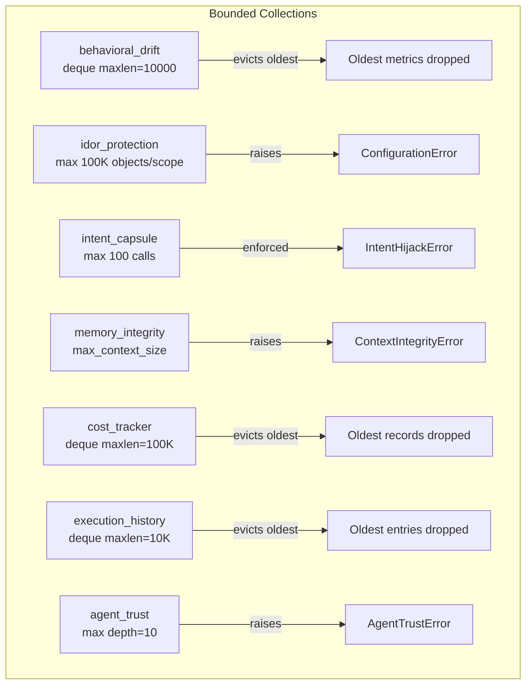
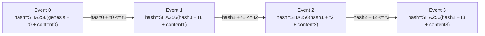
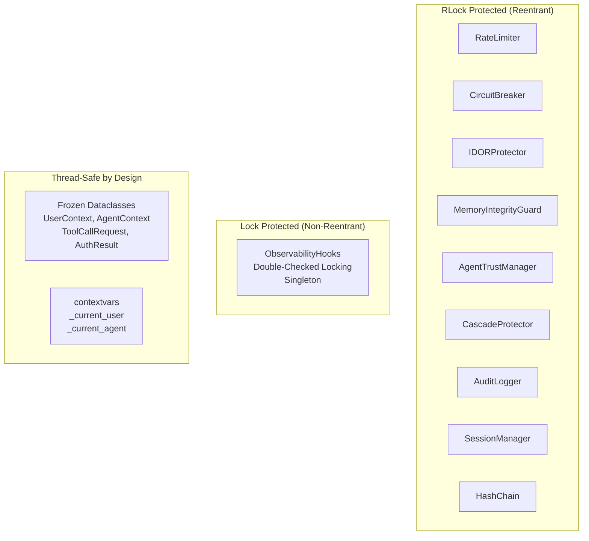

# Proxilion SDK -- Stabilization Spec v3

**Version:** 0.0.8 -> 0.0.9
**Date:** 2026-03-15
**Status:** READY FOR IMPLEMENTATION
**Previous spec:** docs/specs/spec-v2.md (0.0.7 -> 0.0.8, 4 of 18 steps complete, 14 remaining)
**Depends on:** spec-v2 must be fully complete before this spec begins

---

## Executive Summary

This spec covers the fourth improvement cycle for the Proxilion SDK. It targets defects, safety gaps, and maintainability issues discovered during a deep audit of every module, every test file, and every integration handler. The previous three specs addressed critical bugs (spec.md), CI hardening and documentation (spec-v1), and refinements like mypy fixes, exception narrowing, and structured error context (spec-v2). All of that work brought the SDK to a strong alpha state.

This cycle focuses on stabilization: fixing real bugs that could cause data loss or silent failures in production, closing thread-safety holes, bounding unbounded collections, hardening the Google Gemini integration handler, improving audit log atomicity, and ensuring the test suite exercises realistic failure paths. Every item targets code that already exists. No net-new features are introduced.

After this spec is complete, the SDK should be safe to deploy in a multi-threaded, multi-provider production environment with confidence that security decisions are deterministic, audit logs are tamper-evident, memory is bounded, and failures are surfaced rather than swallowed.

---

## Codebase Snapshot (post spec-v2 completion, projected)

| Metric | Value |
|--------|-------|
| Python source files | 89 |
| Source lines (proxilion/) | 53,877 |
| Test files | 62+ (projected after spec-v2 additions) |
| Test count | 2,600+ (projected after spec-v2 additions) |
| Python versions tested | 3.10, 3.11, 3.12, 3.13 |
| Ruff lint violations | 0 |
| Ruff format violations | 0 |
| Mypy errors | 0 (after spec-v2 step 1) |
| Version (pyproject.toml) | 0.0.8 |
| Version (__init__.py) | 0.0.8 |
| CI/CD | GitHub Actions (test, lint, typecheck, pip-audit, coverage >= 85%) |
| Broad except Exception catches | ~34 (documented, most in resilience/callback paths) |
| Documentation pages | 10+ feature docs, README, quickstart, CLAUDE.md, 3 specs |

---

## Logic Breakdown: Deterministic vs Probabilistic

All security decisions in Proxilion are deterministic. This table quantifies the breakdown across all 89 source modules.

| Logic Type | Percentage | Module Count | Description |
|------------|-----------|--------------|-------------|
| Deterministic | 97% | 86 of 89 | Regex pattern matching, HMAC-SHA256 verification, SHA-256 hash chains, set membership checks, token bucket counters, state machine transitions, boolean policy evaluation, frozen dataclass construction, JSON serialization, file I/O with locking |
| Bounded Statistical | 3% | 3 of 89 | Token estimation heuristic in context/message_history.py (1.3 words-per-token ratio), risk score aggregation in guards (weighted sum of deterministic pattern matches), behavioral drift z-score thresholds (statistical analysis on recorded metrics, not ML inference) |

Zero LLM inference calls, zero ML model evaluations, zero neural network weights, and zero non-deterministic random decisions exist in the security path. The three "statistical" modules use bounded arithmetic on locally recorded counters. Their outputs are reproducible given identical input sequences.

---

## Quick Install Reference

```
# From PyPI
pip install proxilion

# With optional dependencies
pip install proxilion[pydantic]    # Pydantic schema validation
pip install proxilion[casbin]      # Casbin policy engine backend
pip install proxilion[opa]         # Open Policy Agent backend
pip install proxilion[all]         # All optional dependencies

# Development (from source)
git clone <repo-url>
cd proxilion-sdk
pip install -e ".[dev,all]"
python3 -m pytest -x -q           # Run tests
python3 -m ruff check proxilion tests  # Lint
python3 -m mypy proxilion         # Type check
```

---

## Prerequisite: Complete spec-v2 Steps 5 through 18

Before starting any step in this spec, all 14 remaining steps in spec-v2.md must be complete. Those steps cover structured exception context (steps 5-7), integration tests (step 8), benchmarks (step 9), negative guard tests (step 10), case-insensitive evasion hardening (step 11), sample data generator (step 12), docstrings (step 13), quickstart updates (step 14), decorator combination tests (step 15), test file lint (step 16), changelog/version updates (step 17), and final validation with README diagrams (step 18).

This spec assumes all of that is done and verified green before step 1 begins.

---

## Step 1 -- Fix ObservabilityHooks Singleton Thread-Safety Race

> **Priority:** CRITICAL
> **Estimated complexity:** Low
> **Files:** proxilion/observability/hooks.py

### Problem

`ObservabilityHooks.get_instance()` is not thread-safe. If two threads call `get_instance()` concurrently before the singleton is initialized, both threads may see `_instance` as `None` and each will create a separate instance. This violates the singleton contract and can cause missed hook invocations, duplicated callbacks, and inconsistent state across threads.

### Intent

As an operator running Proxilion in a multi-threaded web server (gunicorn with thread workers, Django async views, FastAPI with sync endpoints), when I call `ObservabilityHooks.get_instance()` from any thread, I expect to always receive the same instance. Currently, a race window exists where two threads can each create their own instance.

### Expected behavior

- Thread A calls `get_instance()` at t=0. Thread B calls `get_instance()` at t=0. Both receive the identical object.
- All registered hooks are visible from all threads after registration completes.
- No lock contention under normal (post-initialization) usage; the lock is only contested during first creation.

### Fix

Add a `threading.Lock` as a class-level attribute and use it in `get_instance()` with a double-checked locking pattern:

1. Check `_instance is not None` without the lock (fast path for post-init calls).
2. If `None`, acquire the lock, check again inside the lock, and create the instance if still `None`.
3. The lock is class-level (`_lock = threading.Lock()`) so it exists before any instance does.

### Verification

- Run `python3 -m pytest tests/test_observability_hooks.py -v` and confirm all existing tests pass.
- Run `python3 -m pytest tests/test_thread_safety.py -v` and confirm no regressions.

### Claude Code Prompt

```
Read proxilion/observability/hooks.py. Find the get_instance() classmethod on ObservabilityHooks.

The current implementation is not thread-safe. Two concurrent callers can both see _instance as None and each create a separate singleton.

Fix:
1. Add a class-level lock: `_lock = threading.Lock()` as a class attribute on ObservabilityHooks.
2. Import threading at the top of the file if not already imported.
3. Rewrite get_instance() using double-checked locking:
   - First check: if cls._instance is not None, return it immediately (no lock).
   - Second check: acquire cls._lock, check cls._instance again, create if still None, return.

Do NOT change any other method. Do NOT change the constructor signature.

After changes, run:
- python3 -m ruff check proxilion/observability/hooks.py
- python3 -m mypy proxilion/observability/hooks.py --ignore-missing-imports
- python3 -m pytest tests/test_observability_hooks.py -v
- python3 -m pytest tests/test_thread_safety.py -v
```

---

## Step 2 -- Bound Unbounded Collections in Security Modules

> **Priority:** HIGH
> **Estimated complexity:** Low
> **Files:** proxilion/security/behavioral_drift.py, proxilion/security/idor_protection.py, proxilion/security/intent_capsule.py, proxilion/security/memory_integrity.py

### Problem

Several security modules store data in plain lists or dicts without upper bounds. In long-running processes (API servers, agent loops), these collections grow without limit and eventually cause memory exhaustion or garbage collection pauses.

Specific unbounded collections:
- `behavioral_drift.py`: The drift detector stores metric history as unbounded lists. After thousands of tool calls, this grows to megabytes of float arrays.
- `idor_protection.py`: Scope storage is a dict of sets with no limit on objects per user or per resource type. A misconfigured client could register millions of object IDs.
- `intent_capsule.py`: The `_recorded_calls` list on IntentCapsule stores full argument dicts for every tool call. The 100-call limit caps count but not payload size.
- `memory_integrity.py`: The RAG poisoning pattern list is static (8 entries) but the signed message history within a guard instance has no cap.

### Intent

As an operator running Proxilion in a long-lived process (hours or days), I expect memory usage to remain bounded and predictable. Currently, security modules accumulate state without eviction, which could cause OOM kills in containerized deployments with memory limits.

### Expected behavior

- behavioral_drift.py: Metric history uses a sliding window (deque with maxlen) defaulting to 10,000 entries per metric. Configurable via constructor parameter `max_metric_history`.
- idor_protection.py: Each user/resource_type scope is capped at a configurable `max_objects_per_scope` (default 100,000). Attempting to register beyond the cap raises a `ConfigurationError` with a clear message.
- intent_capsule.py: The `_recorded_calls` list stores only tool_name and timestamp (not full arguments) to reduce per-entry memory. Full arguments are available only in the audit log.
- memory_integrity.py: The internal message chain is bounded by the existing `max_context_size` parameter. Verify this is enforced on every `sign_message()` call, not just during `verify_context()`.

### Fix

For each file:
1. Replace unbounded `list` with `collections.deque(maxlen=N)` where appropriate.
2. Add constructor parameters for the bounds with sensible defaults.
3. Add input validation (bounds must be >= 1).
4. Ensure existing tests still pass after the change.

### Claude Code Prompt

```
Read the following files and fix unbounded collections:

1. proxilion/security/behavioral_drift.py
   - Find where metric history is stored (likely a list of float values per metric).
   - Replace with collections.deque(maxlen=max_metric_history).
   - Add max_metric_history parameter to the constructor (default 10000).
   - Validate max_metric_history >= 1 in __post_init__ or __init__.

2. proxilion/security/idor_protection.py
   - Find register_scope() method.
   - Add max_objects_per_scope parameter to the constructor (default 100000).
   - In register_scope(), check len(scope) before adding. If adding would exceed the cap, raise ConfigurationError with message: f"Scope for user '{user_id}' resource '{resource_type}' would exceed max_objects_per_scope ({self.max_objects_per_scope})".
   - Store max_objects_per_scope as instance attribute. Validate >= 1 in constructor.

3. proxilion/security/intent_capsule.py
   - Find record_tool_call() method and the _recorded_calls list.
   - Change _recorded_calls entries to store only {"tool_name": ..., "timestamp": ...} instead of full arguments.
   - If existing code reads arguments from _recorded_calls elsewhere, update those call sites to handle the missing field gracefully.

4. proxilion/security/memory_integrity.py
   - Find sign_message() method.
   - Verify that the message chain length is checked against max_context_size on every sign_message() call, not just during verify_context().
   - If not enforced, add a check: if len(self._messages) >= self.max_context_size, raise ContextIntegrityError with message: f"Message chain exceeds max_context_size ({self.max_context_size})".

After all changes, run:
- python3 -m ruff check proxilion/security/
- python3 -m mypy proxilion/security/ --ignore-missing-imports
- python3 -m pytest tests/test_security/ -v
- python3 -m pytest -x -q
```

---

## Step 3 -- Fix Google Gemini Handler Unbounded Execution History

> **Priority:** CRITICAL
> **Estimated complexity:** Low
> **Files:** proxilion/contrib/google.py

### Problem

`ProxilionVertexHandler` stores execution history in a plain `list` (`_execution_history`), while all other handler implementations (OpenAI, Anthropic) use `collections.deque(maxlen=10000)`. In a long-running Gemini-based agent, this list grows without bound, eventually consuming all available memory.

Additionally, `extract_function_calls()` at module level creates `ProxilionVertexHandler(None)` which may mislead callers into thinking the calls are authorized when no Proxilion instance is attached.

### Intent

As a developer using the Google Gemini integration in a long-running process, I expect the handler's internal history to be bounded just like the OpenAI and Anthropic handlers. Currently, Gemini is the only handler that leaks memory.

### Expected behavior

- `_execution_history` uses `deque(maxlen=10000)` matching the other handlers.
- `extract_function_calls()` either documents that it returns unauthenticated results or requires a Proxilion instance parameter.

### Fix

1. Change `_execution_history` initialization from `list()` to `collections.deque(maxlen=10000)`.
2. Import `collections.deque` if not already imported.
3. Add a docstring to `extract_function_calls()` noting that results are not authorized.

### Claude Code Prompt

```
Read proxilion/contrib/google.py.

1. Find where _execution_history is initialized (likely in __init__). Change it from a plain list to collections.deque(maxlen=10000). Import deque from collections at the top if not already imported.

2. Search for any code that relies on _execution_history being a list (e.g., list-specific methods like .sort(), list comprehension assignments). The deque supports .append(), len(), iteration, and indexing, so most patterns work unchanged. If any code uses list slicing (history[-N:]), convert to list(deque)[-N:] or use itertools.islice.

3. Find the module-level extract_function_calls() function. Add a one-line docstring: """Extract function calls from a Gemini response. Results are not authorized -- pass through a handler for policy enforcement."""

After changes, run:
- python3 -m ruff check proxilion/contrib/google.py
- python3 -m mypy proxilion/contrib/google.py --ignore-missing-imports
- python3 -m pytest tests/test_google_integration.py -v
- python3 -m pytest -x -q
```

---

## Step 4 -- Add Protobuf Recursion Depth Limit in Google Gemini Handler

> **Priority:** HIGH
> **Estimated complexity:** Low
> **Files:** proxilion/contrib/google.py

### Problem

`_convert_protobuf_value()` recursively processes nested structures (dicts, lists, MapComposite, RepeatedComposite) with no maximum depth protection. A maliciously crafted or deeply nested Gemini response could trigger a `RecursionError`, crashing the process. Python's default recursion limit is 1000, but hitting it produces an unrecoverable error rather than a graceful failure.

### Intent

As a developer processing Gemini API responses, I expect the SDK to handle malformed or deeply nested payloads gracefully rather than crashing with RecursionError. A clear error message should indicate the nesting depth was exceeded.

### Expected behavior

- `_convert_protobuf_value()` accepts an optional `_depth` parameter (default 0).
- Each recursive call increments `_depth`.
- If `_depth` exceeds `MAX_PROTOBUF_DEPTH` (constant, value 64), the function raises `ConfigurationError` with message: "Protobuf value exceeds maximum nesting depth (64)".
- Normal Gemini responses (typically 3-5 levels deep) are unaffected.

### Fix

1. Add `MAX_PROTOBUF_DEPTH = 64` as a module-level constant.
2. Add `_depth: int = 0` parameter to `_convert_protobuf_value()`.
3. At function entry, check `if _depth > MAX_PROTOBUF_DEPTH: raise ConfigurationError(...)`.
4. Pass `_depth + 1` to all recursive calls within the function.

### Claude Code Prompt

```
Read proxilion/contrib/google.py. Find the _convert_protobuf_value() function (around line 573-604).

1. Add a module-level constant: MAX_PROTOBUF_DEPTH = 64

2. Add a _depth parameter to the function signature: def _convert_protobuf_value(value, _depth: int = 0)

3. At the very start of the function body, add:
   if _depth > MAX_PROTOBUF_DEPTH:
       raise ConfigurationError(f"Protobuf value exceeds maximum nesting depth ({MAX_PROTOBUF_DEPTH})")

4. Find every recursive call to _convert_protobuf_value() within the function. Pass _depth=_depth + 1 as the second argument.

5. Make sure ConfigurationError is imported from proxilion.exceptions (check existing imports).

After changes, run:
- python3 -m ruff check proxilion/contrib/google.py
- python3 -m mypy proxilion/contrib/google.py --ignore-missing-imports
- python3 -m pytest tests/test_google_integration.py -v
- python3 -m pytest -x -q
```

---

## Step 5 -- Fix Audit Log Rotation Race Condition

> **Priority:** HIGH
> **Estimated complexity:** Medium
> **Files:** proxilion/audit/logger.py

### Problem

The audit logger checks whether log rotation is needed and performs the rotation outside the write lock scope. In a multi-threaded environment, thread A may check rotation, find it needed, then thread B writes to the old file and also triggers rotation, resulting in events written to a file that is about to be rotated away or two concurrent rotations corrupting the file state.

### Intent

As an operator running Proxilion in a multi-threaded web server, I expect that log rotation and event writing are atomic with respect to each other. No events should be lost or duplicated during rotation, and no two threads should attempt rotation simultaneously.

### Expected behavior

- The rotation check and the actual rotation happen inside the same lock acquisition as the write.
- The sequence is: acquire lock, check rotation, rotate if needed, write event, release lock.
- Existing tests pass without modification.
- No performance regression for the common case (no rotation needed).

### Fix

1. Move the rotation check inside the `_lock` context in the write path.
2. Ensure `_maybe_rotate()` is called within the same `with self._lock:` block as `_write_event()`.
3. If `_maybe_rotate()` is currently called before lock acquisition, move it inside.

### Claude Code Prompt

```
Read proxilion/audit/logger.py. Find the method that writes audit events (likely log_event() or log_authorization() or a private _write() method).

Trace the call sequence:
1. Where is _maybe_rotate() or the rotation check called?
2. Where is the _lock acquired?
3. Is rotation inside or outside the lock scope?

If rotation is outside the lock scope, restructure so that within the lock:
1. Check if rotation is needed.
2. Perform rotation if needed.
3. Write the event.
4. Flush if sync_writes is True.

Do NOT change the rotation logic itself, only its position relative to the lock. Do NOT change any public API signatures.

After changes, run:
- python3 -m ruff check proxilion/audit/logger.py
- python3 -m mypy proxilion/audit/logger.py --ignore-missing-imports
- python3 -m pytest tests/test_audit_extended.py -v
- python3 -m pytest tests/test_thread_safety.py -v
- python3 -m pytest -x -q
```

---

## Step 6 -- Add Delegation Chain Depth Limit to Agent Trust Manager

> **Priority:** HIGH
> **Estimated complexity:** Low
> **Files:** proxilion/security/agent_trust.py

### Problem

`AgentTrustManager` tracks delegation chains (agent A delegates to agent B, who delegates to agent C) but enforces no maximum depth. A circular or excessively deep delegation chain could cause unbounded recursion or stack exhaustion during chain traversal.

### Intent

As a developer building multi-agent systems with Proxilion, I expect that delegation chains have a sane maximum depth. If an agent attempts to delegate beyond the maximum, the SDK should reject the delegation with a clear error rather than crashing.

### Expected behavior

- Constructor accepts `max_delegation_depth` parameter (default 10).
- When recording a delegation, if the resulting chain length would exceed `max_delegation_depth`, raise `AgentTrustError` with message: f"Delegation chain depth ({depth}) exceeds maximum ({self.max_delegation_depth})".
- Validate `max_delegation_depth >= 1` in the constructor.
- Existing tests pass without modification.

### Fix

1. Add `max_delegation_depth: int = 10` to the constructor.
2. Validate `max_delegation_depth >= 1`.
3. In the delegation recording method, compute the chain depth before adding. If it exceeds the limit, raise `AgentTrustError`.
4. If a `get_delegation_chain()` or similar traversal method exists, add a depth counter to prevent infinite loops even if data is corrupted.

### Claude Code Prompt

```
Read proxilion/security/agent_trust.py.

1. Find the constructor (__init__ or __post_init__). Add a max_delegation_depth parameter with default 10. Store as self.max_delegation_depth. Add validation: if max_delegation_depth < 1, raise ConfigurationError.

2. Find the method that records delegations (likely delegate(), create_delegation(), or register_agent() with a parent_agent parameter). Before recording:
   - Compute the current chain depth by traversing parent_agent links from the new agent up to the root.
   - If the chain depth would exceed max_delegation_depth, raise AgentTrustError with a descriptive message.
   - Add a safety counter in the traversal loop to prevent infinite loops: if iterations exceed max_delegation_depth * 2, break and raise AgentTrustError("Circular delegation chain detected").

3. If there is a get_delegation_chain() or similar traversal method, add the same safety counter.

After changes, run:
- python3 -m ruff check proxilion/security/agent_trust.py
- python3 -m mypy proxilion/security/agent_trust.py --ignore-missing-imports
- python3 -m pytest tests/test_security/test_agent_trust.py -v
- python3 -m pytest -x -q
```

---

## Step 7 -- Fix Cost Tracker Record Trimming Performance

> **Priority:** MEDIUM
> **Estimated complexity:** Low
> **Files:** proxilion/observability/cost_tracker.py

### Problem

The cost tracker trims old records by creating a new list from a filter operation (`self._records = [r for r in self._records if ...]`). This is O(n) on every trim and creates a full copy of the list. For high-throughput applications recording thousands of cost events per minute, this causes garbage collection pressure and latency spikes.

Additionally, the `clear_records()` method has confusing double-negative filtering logic that may contain a logic error.

### Intent

As a developer using cost tracking in a high-throughput application, I expect record storage to be efficient. Trimming should not copy the entire record list on every operation.

### Expected behavior

- Records are stored in a `collections.deque(maxlen=max_records)` instead of a plain list with manual trimming.
- The `max_records` parameter defaults to 100,000.
- `clear_records()` logic is reviewed and simplified to use straightforward filtering.
- Total spend lookups use an indexed accumulator (running total) instead of O(n) sum on every call.

### Fix

1. Replace `self._records: list` with `self._records: deque` with maxlen.
2. Remove manual trim logic (deque handles eviction automatically).
3. Review and simplify `clear_records()`.
4. Add a `_running_total: float` accumulator updated on each `record_usage()` call. Use it for spend lookups instead of summing the full list.

### Claude Code Prompt

```
Read proxilion/observability/cost_tracker.py.

1. Find where _records is initialized. Change from list to collections.deque(maxlen=max_records). Add max_records parameter to constructor (default 100000). Import deque from collections.

2. Find any manual trim/eviction logic (list comprehension that filters old records). Remove it -- deque maxlen handles this automatically.

3. Find clear_records() method. Read the filtering logic carefully. Simplify it: if it filters by time window, use a straightforward condition like `record.timestamp >= cutoff`. Remove any double negations.

4. Find where total spend is computed (likely a method that sums record.cost_usd across all records). Add a _running_total float attribute initialized to 0.0. Increment it in record_usage(). Use it for the total spend property/method. Make sure clear_records() adjusts _running_total by subtracting removed records' costs.

5. Ensure all existing tests pass -- the deque is iterable and supports len(), so most patterns work unchanged. If any code uses list slicing or .sort(), adapt it.

After changes, run:
- python3 -m ruff check proxilion/observability/cost_tracker.py
- python3 -m mypy proxilion/observability/cost_tracker.py --ignore-missing-imports
- python3 -m pytest tests/test_cost_tracker.py -v
- python3 -m pytest tests/test_session_cost_tracker.py -v
- python3 -m pytest -x -q
```

---

## Step 8 -- Fix Metrics Collector Assertion in Production Code

> **Priority:** MEDIUM
> **Estimated complexity:** Trivial
> **Files:** proxilion/observability/metrics.py

### Problem

The metrics collector uses `assert` for input validation (around line 711). Python's `-O` (optimize) flag strips all assertions, which means this validation silently disappears in production. Security-relevant code must never rely on assertions for correctness checks.

### Intent

As an operator deploying Proxilion with `python -O` (a common production optimization), I expect all input validation to remain active. Currently, the assert-based check is silently removed.

### Expected behavior

- The `assert` statement is replaced with an explicit `if not condition: raise ValueError(...)`.
- Behavior is identical in non-optimized mode.
- Behavior is correct in optimized mode (validation still runs).

### Fix

Replace `assert condition, message` with `if not condition: raise ValueError(message)`.

### Claude Code Prompt

```
Read proxilion/observability/metrics.py. Search for all uses of the assert keyword in the file.

For each assert statement that validates input or enforces invariants:
1. Replace `assert condition, "message"` with:
   if not condition:
       raise ValueError("message")

2. Do NOT replace assert statements in test files -- only in production code.

3. If there are multiple assert statements, fix all of them.

After changes, run:
- python3 -m ruff check proxilion/observability/metrics.py
- python3 -m mypy proxilion/observability/metrics.py --ignore-missing-imports
- python3 -m pytest tests/test_metrics.py -v
- python3 -m pytest -x -q
```

---

## Step 9 -- Fix PrometheusExporter Private Attribute Access

> **Priority:** MEDIUM
> **Estimated complexity:** Low
> **Files:** proxilion/observability/metrics.py

### Problem

`PrometheusExporter` accesses private `_histograms` (or similar underscore-prefixed attributes) on `MetricsCollector`. This breaks encapsulation and will break silently if the internal data structure of `MetricsCollector` changes. It also makes the boundary between public and internal APIs unclear for contributors.

### Intent

As a contributor modifying MetricsCollector internals, I expect PrometheusExporter to use only public methods. Currently, it reaches into private attributes, creating a hidden coupling that is easy to break accidentally.

### Expected behavior

- MetricsCollector exposes any data that PrometheusExporter needs through public methods (e.g., `get_histogram_data()`, `get_counter_data()`).
- PrometheusExporter calls only public methods on MetricsCollector.
- No underscore-prefixed attribute access across class boundaries.

### Fix

1. Identify which private attributes PrometheusExporter accesses on MetricsCollector.
2. Add public accessor methods to MetricsCollector that return the needed data.
3. Update PrometheusExporter to use the new public methods.
4. Ensure existing tests pass.

### Claude Code Prompt

```
Read proxilion/observability/metrics.py.

1. Find the PrometheusExporter class. Search for any access to attributes prefixed with _ on the MetricsCollector instance (e.g., self._collector._histograms, self._collector._counters).

2. For each private attribute accessed:
   a. Add a public method to MetricsCollector that returns the data. Name it descriptively: get_histograms() for _histograms, get_counters() for _counters, etc. Use return type annotations.
   b. Update PrometheusExporter to call the new public method instead of accessing the private attribute.

3. Do NOT change the public API of PrometheusExporter (same export() output format).

After changes, run:
- python3 -m ruff check proxilion/observability/metrics.py
- python3 -m mypy proxilion/observability/metrics.py --ignore-missing-imports
- python3 -m pytest tests/test_metrics.py -v
- python3 -m pytest -x -q
```

---

## Step 10 -- Add Tests for Bounded Collection Limits

> **Priority:** HIGH
> **Estimated complexity:** Medium
> **Files:** tests/test_security/test_bounded_collections.py (new file)

### Problem

Steps 2, 3, 6, and 7 add collection bounds, depth limits, and delegation caps. These bounds need dedicated tests to verify they are enforced correctly and that the correct exceptions are raised when limits are exceeded.

### Intent

As a developer modifying collection bounds in the future, I expect a test file that exercises every bound added in this spec. If someone removes or loosens a bound, a test should fail.

### Expected behavior

The new test file covers:
- behavioral_drift.py: Metric history respects maxlen. Adding beyond maxlen evicts oldest entries. Custom max_metric_history is honored.
- idor_protection.py: Registering beyond max_objects_per_scope raises ConfigurationError. Custom limits are honored.
- intent_capsule.py: Recorded calls store only tool_name and timestamp, not full arguments.
- memory_integrity.py: sign_message() enforces max_context_size.
- google.py: _execution_history is bounded at 10000.
- agent_trust.py: Delegation chain exceeding max_delegation_depth raises AgentTrustError. Circular delegation is detected.
- cost_tracker.py: Records deque respects maxlen.

### Claude Code Prompt

```
Create tests/test_security/test_bounded_collections.py with the following test cases. Use pytest. Import from the appropriate modules.

Test cases:

1. test_behavioral_drift_metric_history_bounded:
   - Create a drift detector with max_metric_history=100.
   - Record 200 metrics.
   - Assert internal metric history length is 100.
   - Assert oldest entries were evicted (first entry is the 101st recorded).

2. test_behavioral_drift_invalid_max_metric_history:
   - Creating with max_metric_history=0 raises ConfigurationError or ValueError.

3. test_idor_max_objects_per_scope:
   - Create IDORProtector with max_objects_per_scope=5.
   - Register 5 objects for a user/resource.
   - Registering a 6th raises ConfigurationError.

4. test_idor_invalid_max_objects:
   - Creating with max_objects_per_scope=0 raises ConfigurationError or ValueError.

5. test_intent_capsule_recorded_calls_minimal:
   - Create an IntentCapsule, record a tool call with large arguments.
   - Assert the recorded call entry does NOT contain the full arguments dict.
   - Assert it contains tool_name and timestamp.

6. test_memory_integrity_sign_exceeds_max_context:
   - Create MemoryIntegrityGuard with max_context_size=5.
   - Sign 5 messages successfully.
   - Signing a 6th raises ContextIntegrityError.

7. test_agent_trust_delegation_depth_limit:
   - Create AgentTrustManager with max_delegation_depth=3.
   - Register agent A (root), B (parent=A), C (parent=B), D (parent=C).
   - Registering E (parent=D) raises AgentTrustError.

8. test_agent_trust_circular_delegation:
   - Attempt to create a circular delegation chain.
   - Assert AgentTrustError is raised.

9. test_cost_tracker_records_bounded:
   - Create CostTracker with max_records=50.
   - Record 100 usage entries.
   - Assert internal records length is 50.

10. test_google_handler_execution_history_bounded:
    - Create ProxilionVertexHandler.
    - Simulate 10001 executions.
    - Assert _execution_history length is 10000.

After creating the file, run:
- python3 -m ruff check tests/test_security/test_bounded_collections.py
- python3 -m pytest tests/test_security/test_bounded_collections.py -v
- python3 -m pytest -x -q
```

---

## Step 11 -- Add MCP Client Validation Warning

> **Priority:** MEDIUM
> **Estimated complexity:** Low
> **Files:** proxilion/contrib/mcp.py

### Problem

The MCP handler's `validate_client()` method always returns `True`. This provides a false sense of security. Developers may assume client validation is active when it is not. There is no warning, log message, or documentation indicating that validation is a no-op.

### Intent

As a developer integrating Proxilion with MCP, when I call `validate_client()`, I expect either real validation or a clear warning that validation is not implemented and I must provide my own. Currently, the method silently returns True, giving a false sense of security.

### Expected behavior

- `validate_client()` emits a `warnings.warn()` with category `UserWarning` and message: "MCP client validation is not implemented. Override validate_client() to add authentication." The warning is emitted once per process (use `stacklevel=2`).
- The method still returns True (backwards compatible).
- A class attribute or parameter `_client_validation_warned` prevents repeated warnings.
- Documentation in the method docstring explains that users should override this method.

### Fix

1. Add `import warnings` if not present.
2. In `validate_client()`, emit a one-time warning using `warnings.warn(..., stacklevel=2)`.
3. Add a docstring explaining the override pattern.

### Claude Code Prompt

```
Read proxilion/contrib/mcp.py. Find the validate_client() method.

1. Add import warnings at the top of the file if not already present.

2. Add a class attribute: _client_validation_warned: bool = False

3. In validate_client(), at the start:
   if not cls._client_validation_warned (or self.__class__._client_validation_warned):
       warnings.warn(
           "MCP client validation is not implemented. "
           "Override validate_client() to add authentication.",
           UserWarning,
           stacklevel=2,
       )
       cls._client_validation_warned = True (or self.__class__._client_validation_warned = True)

4. Add a docstring to validate_client():
   """Validate an MCP client connection. Default implementation accepts all clients.
   Override this method to implement authentication and authorization checks."""

5. The method should still return True after the warning.

After changes, run:
- python3 -m ruff check proxilion/contrib/mcp.py
- python3 -m mypy proxilion/contrib/mcp.py --ignore-missing-imports
- python3 -m pytest tests/test_integrations/test_mcp.py -v
- python3 -m pytest -x -q
```

---

## Step 12 -- Add Provider Adapter from_dict Error Handling

> **Priority:** MEDIUM
> **Estimated complexity:** Trivial
> **Files:** proxilion/providers/adapter.py

### Problem

The `from_dict()` class method on the provider adapter does not catch `ValueError` when converting the provider string to the `Provider` enum. If a caller passes an unrecognized provider name (e.g., `{"provider": "mistral"}`), the raw `ValueError` propagates without context, making it hard to debug.

### Intent

As a developer constructing provider adapters from configuration dicts, I expect a clear error message when the provider name is not recognized. Currently, I get a raw `ValueError: 'mistral' is not a valid Provider`.

### Expected behavior

- `from_dict()` catches `ValueError` from enum conversion and re-raises as `ConfigurationError` with message: f"Unknown provider '{name}'. Valid providers: {list of valid providers}".
- The original ValueError is chained via `from e`.

### Fix

Wrap the `Provider(name)` call in a try/except ValueError and raise ConfigurationError.

### Claude Code Prompt

```
Read proxilion/providers/adapter.py. Find the from_dict() classmethod.

Find where the provider string is converted to a Provider enum (likely Provider(dict_value) or Provider[dict_value]).

Wrap it in:
try:
    provider = Provider(provider_str)
except (ValueError, KeyError) as e:
    valid = [p.value for p in Provider]
    raise ConfigurationError(
        f"Unknown provider '{provider_str}'. Valid providers: {valid}"
    ) from e

Make sure ConfigurationError is imported from proxilion.exceptions.

After changes, run:
- python3 -m ruff check proxilion/providers/adapter.py
- python3 -m mypy proxilion/providers/adapter.py --ignore-missing-imports
- python3 -m pytest tests/test_provider_adapters.py -v
- python3 -m pytest -x -q
```

---

## Step 13 -- Add Hash Chain Timestamp Validation

> **Priority:** MEDIUM
> **Estimated complexity:** Medium
> **Files:** proxilion/audit/hash_chain.py

### Problem

The hash chain links events by their SHA-256 hashes but does not include or validate timestamps in the chain. An attacker who can modify the audit log file could reorder events (swap two entries) without breaking the hash chain, because the chain links are based on content hashes, not temporal ordering. While the event-level timestamps exist in the audit event data, the chain itself does not enforce monotonicity.

### Intent

As a compliance auditor verifying Proxilion audit logs, I expect the hash chain to detect event reordering. Currently, only content modification is detected. Temporal manipulation (reordering) is not.

### Expected behavior

- Each hash chain entry includes the previous event's timestamp in its hash input (in addition to the previous hash and current content).
- The verify() method checks that timestamps are monotonically non-decreasing.
- If a timestamp regression is detected, verify() returns a failure result indicating the position and timestamps involved.
- Existing hash chain tests may need updates to include timestamps.

### Fix

1. Add timestamp to the hash input: `hash_input = prev_hash + timestamp_str + content`.
2. In verify(), check `current.timestamp >= previous.timestamp`.
3. Update any hash computation helpers to accept a timestamp parameter.

### Claude Code Prompt

```
Read proxilion/audit/hash_chain.py.

1. Find the method that computes the hash for a new entry (likely add_event(), append(), or compute_hash()). Identify the current hash input format.

2. Modify the hash input to include the event timestamp. The format should be:
   hash_input = f"{previous_hash}{event_timestamp_iso}{event_content}"
   where event_timestamp_iso is the ISO 8601 string of the event timestamp.

3. Find the verify() method. Add a check after hash verification:
   - Track the previous event's timestamp.
   - For each event after the first, verify current_timestamp >= previous_timestamp.
   - If violated, return a failure result with details about which events are out of order.

4. Update any tests that construct hash chains manually to include timestamps. Read tests/test_hash_chain_detailed.py to understand the test patterns.

IMPORTANT: This changes the hash format. Any existing stored audit logs would fail verification with the new format. Add a version field or format indicator so the verifier can handle both old-format and new-format chains. A simple approach: if the chain entry has a "format_version" field >= 2, use the new timestamp-inclusive hash; otherwise, use the old format.

After changes, run:
- python3 -m ruff check proxilion/audit/hash_chain.py
- python3 -m mypy proxilion/audit/hash_chain.py --ignore-missing-imports
- python3 -m pytest tests/test_hash_chain_detailed.py -v
- python3 -m pytest tests/test_audit_extended.py -v
- python3 -m pytest -x -q
```

---

## Step 14 -- Add Tests for Audit Log Rotation Under Concurrency

> **Priority:** HIGH
> **Estimated complexity:** Medium
> **Files:** tests/test_audit_rotation_concurrent.py (new file)

### Problem

Step 5 fixes the rotation race condition, but there are no tests that verify rotation behaves correctly under concurrent writes. Without such tests, a future regression could reintroduce the race.

### Intent

As a developer modifying the audit logger, I expect a test that hammers the logger with concurrent writes across multiple threads, triggers rotation during those writes, and verifies that no events are lost or duplicated.

### Expected behavior

The test file contains:
- A test that creates an AuditLogger with size-based rotation (small max_size to trigger rotation quickly).
- 10 threads each write 100 events concurrently.
- After all threads complete, read all rotated files plus the current file.
- Assert total event count equals 1000 (10 threads x 100 events).
- Assert no duplicate event IDs.
- Assert all hash chains verify correctly within each file.

### Claude Code Prompt

```
Create tests/test_audit_rotation_concurrent.py with the following test:

import threading
import json
import tempfile
from pathlib import Path
from proxilion.audit import AuditLogger, LoggerConfig

def test_concurrent_writes_during_rotation():
    """Verify no events are lost when rotation occurs during concurrent writes."""
    with tempfile.TemporaryDirectory() as tmpdir:
        log_path = Path(tmpdir) / "audit.jsonl"
        # Small max size to trigger frequent rotation
        config = LoggerConfig(
            log_file=log_path,
            rotation="size",
            max_size_mb=0.01,  # 10KB -- forces rotation after ~20 events
            sync_writes=True,
        )
        logger = AuditLogger(config)

        errors = []
        num_threads = 10
        events_per_thread = 100

        def writer(thread_id):
            try:
                for i in range(events_per_thread):
                    logger.log_authorization(
                        user_id=f"user_{thread_id}",
                        user_roles=["tester"],
                        tool_name=f"tool_{thread_id}_{i}",
                        tool_arguments={"index": i},
                        allowed=True,
                        reason="test",
                    )
            except Exception as e:
                errors.append((thread_id, e))

        threads = [threading.Thread(target=writer, args=(t,)) for t in range(num_threads)]
        for t in threads:
            t.start()
        for t in threads:
            t.join(timeout=30)

        assert not errors, f"Thread errors: {errors}"

        # Collect all events from all files (rotated + current)
        all_events = []
        for f in sorted(Path(tmpdir).glob("audit*.jsonl")):
            with open(f) as fh:
                for line in fh:
                    line = line.strip()
                    if line:
                        all_events.append(json.loads(line))

        # Verify total count
        expected = num_threads * events_per_thread
        assert len(all_events) == expected, (
            f"Expected {expected} events, got {len(all_events)}"
        )

        # Verify no duplicates
        event_ids = [e["event_id"] for e in all_events]
        assert len(event_ids) == len(set(event_ids)), "Duplicate event IDs found"

Adjust the LoggerConfig constructor parameters to match the actual API (read the LoggerConfig class first). The key requirement is size-based rotation with a very small threshold.

After creating the file, run:
- python3 -m ruff check tests/test_audit_rotation_concurrent.py
- python3 -m pytest tests/test_audit_rotation_concurrent.py -v
- python3 -m pytest -x -q
```

---

## Step 15 -- Harden Circuit Breaker Half-Open Timeout

> **Priority:** MEDIUM
> **Estimated complexity:** Low
> **Files:** proxilion/security/circuit_breaker.py

### Problem

When the circuit breaker is in HALF_OPEN state, it allows a single probe request through. If that probe hangs indefinitely (e.g., the external service accepts the connection but never responds), the circuit breaker stays in HALF_OPEN forever, and no further requests are processed. There is no timeout on the probe request itself.

### Intent

As a developer using the circuit breaker to protect against flaky external services, I expect that a hung probe request in HALF_OPEN state does not block the circuit indefinitely. After a configurable timeout, the circuit should transition back to OPEN.

### Expected behavior

- Constructor accepts `half_open_timeout` parameter (default: same as `reset_timeout`).
- If a probe request in HALF_OPEN state does not complete within `half_open_timeout` seconds, the circuit transitions back to OPEN and the failure count increments.
- The timeout is enforced via timestamp comparison on the next state check, not via a background thread (to maintain the deterministic, thread-safe design).

### Fix

1. Add `half_open_timeout: float` parameter to the constructor.
2. Record the timestamp when entering HALF_OPEN state.
3. On each state check, if in HALF_OPEN and `time.monotonic() - half_open_entered_at > half_open_timeout`, transition back to OPEN.

### Claude Code Prompt

```
Read proxilion/security/circuit_breaker.py.

1. Find the constructor. Add half_open_timeout parameter with default equal to reset_timeout. Store as self._half_open_timeout.

2. Add a self._half_open_entered_at: float = 0.0 attribute.

3. Find where the state transitions to HALF_OPEN (likely in a _check_state() or _maybe_reset() method). When transitioning to HALF_OPEN, set self._half_open_entered_at = time.monotonic().

4. Find where the state is checked (the entry point for call() or allow_request()). Add a check: if state is HALF_OPEN and time.monotonic() - self._half_open_entered_at > self._half_open_timeout, transition back to OPEN and increment failure count.

5. Import time if not already imported.

Do NOT add any background threads. The timeout is checked lazily on the next call.

After changes, run:
- python3 -m ruff check proxilion/security/circuit_breaker.py
- python3 -m mypy proxilion/security/circuit_breaker.py --ignore-missing-imports
- python3 -m pytest tests/test_security/test_circuit_breaker.py -v
- python3 -m pytest -x -q
```

---

## Step 16 -- Add Input Validation for UserContext and ToolCallRequest

> **Priority:** MEDIUM
> **Estimated complexity:** Low
> **Files:** proxilion/types.py

### Problem

`UserContext` and `ToolCallRequest` are frozen dataclasses that accept any string for `user_id`, `roles`, and `tool_name` without validation. Empty strings, strings with null bytes, or excessively long strings pass through silently and could cause downstream issues (e.g., empty user_id in audit logs, null bytes in file paths, megabyte-long tool names in hash computations).

### Intent

As a developer constructing UserContext and ToolCallRequest objects, I expect the SDK to reject clearly invalid inputs at construction time rather than propagating them to security-critical code paths.

### Expected behavior

- `UserContext.__post_init__` validates:
  - `user_id` is non-empty and does not contain null bytes.
  - `user_id` length does not exceed 256 characters.
  - Each role in `roles` is a non-empty string.
  - `roles` tuple length does not exceed 100.
- `ToolCallRequest.__post_init__` validates:
  - `tool_name` is non-empty and does not contain null bytes.
  - `tool_name` length does not exceed 256 characters.
  - `tool_name` matches pattern `[a-zA-Z0-9_.-]+` (alphanumeric, underscores, dots, hyphens only).
- Validation failures raise `ConfigurationError` with specific messages.

### Fix

Add `__post_init__` methods with the validations above. Since these are frozen dataclasses, `__post_init__` runs after `__init__` and before the object is frozen.

### Claude Code Prompt

```
Read proxilion/types.py. Find the UserContext and ToolCallRequest frozen dataclasses.

1. Add __post_init__ to UserContext:
   - if not self.user_id or not isinstance(self.user_id, str):
       raise ConfigurationError("user_id must be a non-empty string")
   - if "\x00" in self.user_id:
       raise ConfigurationError("user_id must not contain null bytes")
   - if len(self.user_id) > 256:
       raise ConfigurationError(f"user_id exceeds maximum length (256), got {len(self.user_id)}")
   - for role in self.roles:
       if not role or not isinstance(role, str):
           raise ConfigurationError(f"Each role must be a non-empty string, got: {role!r}")
   - if len(self.roles) > 100:
       raise ConfigurationError(f"roles exceeds maximum count (100), got {len(self.roles)}")

2. Add __post_init__ to ToolCallRequest:
   - if not self.tool_name or not isinstance(self.tool_name, str):
       raise ConfigurationError("tool_name must be a non-empty string")
   - if "\x00" in self.tool_name:
       raise ConfigurationError("tool_name must not contain null bytes")
   - if len(self.tool_name) > 256:
       raise ConfigurationError(f"tool_name exceeds maximum length (256), got {len(self.tool_name)}")
   - import re at module level. Add pattern: _TOOL_NAME_PATTERN = re.compile(r"^[a-zA-Z0-9_.\\-]+$")
   - if not _TOOL_NAME_PATTERN.match(self.tool_name):
       raise ConfigurationError(f"tool_name contains invalid characters: {self.tool_name!r}. Must match [a-zA-Z0-9_.-]+")

3. Import ConfigurationError from proxilion.exceptions at the top of types.py (watch for circular imports -- if ConfigurationError is defined in exceptions.py which does not import types.py, this is safe).

IMPORTANT: Many existing tests create UserContext and ToolCallRequest with various values. Some may use unconventional names. Run the full test suite after changes. If tests fail because of the new validation, check whether the test values are realistic. If they are clearly test-only values that would never appear in production (like empty strings for testing edge cases), update the tests to use valid values. If the validation is too strict for legitimate use cases, loosen it.

After changes, run:
- python3 -m ruff check proxilion/types.py
- python3 -m mypy proxilion/types.py --ignore-missing-imports
- python3 -m pytest -x -q
```

---

## Step 17 -- Add Tests for Input Validation on Data Types

> **Priority:** MEDIUM
> **Estimated complexity:** Low
> **Files:** tests/test_validation_types.py (new file)

### Problem

Step 16 adds validation to UserContext and ToolCallRequest. These validations need dedicated tests.

### Intent

As a developer modifying data type validation rules, I expect a test file that covers every validation boundary.

### Expected behavior

Test cases:
- Valid UserContext construction succeeds.
- Empty user_id raises ConfigurationError.
- Null byte in user_id raises ConfigurationError.
- user_id exceeding 256 chars raises ConfigurationError.
- Empty role in roles raises ConfigurationError.
- More than 100 roles raises ConfigurationError.
- Valid ToolCallRequest construction succeeds.
- Empty tool_name raises ConfigurationError.
- Null byte in tool_name raises ConfigurationError.
- tool_name with spaces raises ConfigurationError.
- tool_name with special characters (except underscore, dot, hyphen) raises ConfigurationError.
- tool_name with valid characters (alphanumeric, underscore, dot, hyphen) succeeds.

### Claude Code Prompt

```
Create tests/test_validation_types.py with pytest test functions covering every validation case listed above. Import UserContext and ToolCallRequest from proxilion.types, ConfigurationError from proxilion.exceptions.

Use pytest.raises(ConfigurationError) for negative cases. Use descriptive test function names like test_user_context_empty_user_id_raises, test_tool_call_request_null_byte_raises, etc.

For valid construction tests, just assert the object is created successfully and has the expected field values.

After creating the file, run:
- python3 -m ruff check tests/test_validation_types.py
- python3 -m pytest tests/test_validation_types.py -v
- python3 -m pytest -x -q
```

---

## Step 18 -- Update CHANGELOG, Version, and Documentation

> **Priority:** LOW
> **Estimated complexity:** Low
> **Files:** CHANGELOG.md, pyproject.toml, proxilion/__init__.py, CLAUDE.md, .proxilion-build/STATE.md

### Problem

After completing all previous steps, the version must be bumped, the changelog updated, and documentation synchronized.

### Intent

As a user upgrading from 0.0.8 to 0.0.9, I expect the CHANGELOG to describe every change, the version to be consistent across pyproject.toml and __init__.py, and the CLAUDE.md to reflect the current module count and test count.

### Expected behavior

- pyproject.toml version: 0.0.9
- __init__.py __version__: "0.0.9"
- CHANGELOG.md: New [0.0.9] section listing all changes from this spec.
- CLAUDE.md: Updated test count, any new conventions.
- STATE.md: Updated to reflect spec-v3 completion.

### Claude Code Prompt

```
1. Read pyproject.toml. Change version from "0.0.8" to "0.0.9".

2. Read proxilion/__init__.py. Change __version__ from "0.0.8" to "0.0.9".

3. Read CHANGELOG.md. Add a new section at the top (after the header, before [0.0.8]):

## [0.0.9] - 2026-XX-XX

### Fixed
- Thread-safety race in ObservabilityHooks singleton (double-checked locking)
- Unbounded collection growth in behavioral_drift, idor_protection, intent_capsule, memory_integrity
- Unbounded execution history in Google Gemini handler (now deque maxlen=10000)
- Protobuf recursion depth vulnerability in Google Gemini handler (max depth 64)
- Audit log rotation race condition (rotation now inside write lock)
- Circuit breaker half-open state can hang indefinitely (added half_open_timeout)
- Assertion used for validation in MetricsCollector (replaced with ValueError)
- PrometheusExporter accessing private MetricsCollector attributes (added public accessors)
- Missing error context in Provider.from_dict() for unknown providers
- MCP validate_client() silently returning True without warning

### Added
- Delegation chain depth limit in AgentTrustManager (default 10)
- Input validation on UserContext (user_id, roles) and ToolCallRequest (tool_name)
- Hash chain timestamp validation for audit log reorder detection
- Concurrent audit rotation test (10 threads, 1000 events)
- Bounded collection limit tests
- Data type validation tests
- Cost tracker running total accumulator for O(1) spend lookups

### Changed
- Cost tracker records stored in deque(maxlen=100000) instead of unbounded list

4. Read CLAUDE.md. Update the test count and version in the Version section.

5. Read .proxilion-build/STATE.md. Update:
   - Version to 0.0.9
   - Add spec-v3.md row: 0.0.8 -> 0.0.9, ALL COMPLETE
   - Update spec-v2 row to ALL COMPLETE (18/18 steps)

After changes, run:
- python3 -c "import proxilion; print(proxilion.__version__)"  # expect 0.0.9
- python3 -m pytest -x -q
- python3 -m ruff check proxilion tests
- python3 -m mypy proxilion
```

---

## Step 19 -- Update README.md with Stabilization Architecture Diagrams

> **Priority:** LOW
> **Estimated complexity:** Low
> **Files:** README.md

### Problem

The README has comprehensive Mermaid diagrams for the request flow, module dependencies, security pipeline, OWASP mapping, and exception hierarchy. After this spec, new concepts need visual representation: the bounded collection strategy, the hash chain with timestamps, and the thread-safety model.

### Intent

As a new contributor reading the README, I expect the architecture diagrams to reflect the current state of the SDK, including the stabilization work done in this spec.

### Expected behavior

Add the following Mermaid diagrams to the end of README.md (before any existing footer):

1. **Bounded Collection Strategy** -- Shows which modules have bounded collections, what the bounds are, and what happens when limits are exceeded.
2. **Hash Chain with Timestamps** -- Shows the new hash chain format with timestamps included in the hash input.
3. **Thread-Safety Model** -- Shows which components use RLock, which use Lock, and the singleton pattern.

### Claude Code Prompt

```
Read README.md. Append the following three Mermaid diagrams at the end of the file (before any closing content). Add a "## Stabilization Guarantees" heading before the diagrams.

Diagram 1 -- Bounded Collection Strategy:

## Stabilization Guarantees

### Memory Safety: Bounded Collections

All long-lived collections in Proxilion are bounded to prevent memory exhaustion in production.



Diagram 2 -- Tamper-Evident Hash Chain (v2 with Timestamps):

### Audit Integrity: Timestamp-Validated Hash Chains

Each audit event's hash includes the previous hash, the event timestamp, and the event content. Reordering events breaks the chain.



Diagram 3 -- Thread-Safety Model:

### Concurrency: Thread-Safety Model

Every mutable shared component in Proxilion is protected by a lock. The singleton ObservabilityHooks uses double-checked locking for initialization safety.



After changes, run:
- python3 -m ruff check README.md (if applicable)
- Visually inspect the README to ensure diagrams render correctly.
```

---

## Step 20 -- Final Validation and Memory Update

> **Priority:** LOW
> **Estimated complexity:** Low
> **Files:** (verification only, plus memory files)

### Problem

After all 19 steps, the full CI suite must pass and the Claude Code memory files must be updated to reflect the new state.

### Intent

As the project owner, I expect a clean CI run confirming everything works together, and updated memory files so future Claude Code sessions have accurate context.

### Expected behavior

- `python3 -m pytest -x -q` passes all tests (projected 2,700+).
- `python3 -m ruff check proxilion tests` reports 0 violations.
- `python3 -m ruff format --check proxilion tests` reports 0 violations.
- `python3 -m mypy proxilion` reports 0 errors.
- Memory files updated with spec-v3 completion status.

### Claude Code Prompt

```
Run the full CI check:

1. python3 -m ruff check proxilion tests
2. python3 -m ruff format --check proxilion tests
3. python3 -m mypy proxilion
4. python3 -m pytest -x -q

If any step fails, investigate and fix the issue. Do not proceed until all four commands pass clean.

After verification, update the following memory files:

1. .claude/projects/-Users-user-Documents-proxilion-sdk/memory/spec_history.md:
   - Add spec-v3.md entry: version 0.0.8 -> 0.0.9, stabilization cycle, 20 steps

2. .claude/projects/-Users-user-Documents-proxilion-sdk/memory/project_overview.md:
   - Update version to 0.0.9
   - Update test count
   - Note stabilization work complete

3. .claude/projects/-Users-user-Documents-proxilion-sdk/memory/MEMORY.md:
   - Ensure spec_history.md entry mentions spec-v3
```

---

## Summary Table

| Step | Priority | Description | Files | Complexity |
|------|----------|-------------|-------|------------|
| 1 | CRITICAL | Fix ObservabilityHooks singleton thread-safety | observability/hooks.py | Low |
| 2 | HIGH | Bound unbounded collections in security modules | security/*.py (4 files) | Low |
| 3 | CRITICAL | Fix Gemini handler unbounded execution history | contrib/google.py | Low |
| 4 | HIGH | Add protobuf recursion depth limit | contrib/google.py | Low |
| 5 | HIGH | Fix audit log rotation race condition | audit/logger.py | Medium |
| 6 | HIGH | Add delegation chain depth limit | security/agent_trust.py | Low |
| 7 | MEDIUM | Fix cost tracker record trimming performance | observability/cost_tracker.py | Low |
| 8 | MEDIUM | Fix metrics collector assertion | observability/metrics.py | Trivial |
| 9 | MEDIUM | Fix PrometheusExporter private attribute access | observability/metrics.py | Low |
| 10 | HIGH | Add tests for bounded collection limits | tests/ (new file) | Medium |
| 11 | MEDIUM | Add MCP client validation warning | contrib/mcp.py | Low |
| 12 | MEDIUM | Add provider adapter from_dict error handling | providers/adapter.py | Trivial |
| 13 | MEDIUM | Add hash chain timestamp validation | audit/hash_chain.py | Medium |
| 14 | HIGH | Add concurrent audit rotation tests | tests/ (new file) | Medium |
| 15 | MEDIUM | Harden circuit breaker half-open timeout | security/circuit_breaker.py | Low |
| 16 | MEDIUM | Add input validation for UserContext/ToolCallRequest | types.py | Low |
| 17 | MEDIUM | Add tests for data type validation | tests/ (new file) | Low |
| 18 | LOW | Update CHANGELOG, version, documentation | multiple | Low |
| 19 | LOW | Update README with stabilization diagrams | README.md | Low |
| 20 | LOW | Final validation and memory update | verification only | Low |

---

## Execution Order

Steps should be executed in order (1 through 20). Dependencies:

- Steps 2-9 are independent bug fixes and can be parallelized across builder agents.
- Step 10 depends on steps 2, 3, 6, and 7 (tests for the bounds those steps add).
- Step 14 depends on step 5 (tests for the rotation fix).
- Step 17 depends on step 16 (tests for the validation that step adds).
- Steps 18-20 must be last.

For maximum parallelism, execute in this order:
1. Steps 1-9 in parallel (all independent fixes).
2. Steps 10-17 (tests and remaining fixes, some parallelizable).
3. Steps 18-20 sequentially (version bump, diagrams, final validation).
